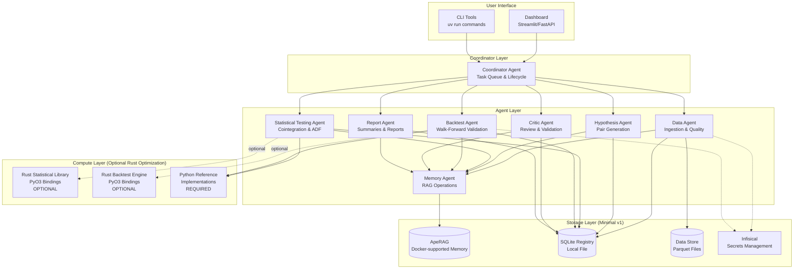

# Technical Design Document: Multi-Agent Quantitative Research System

## Overview

This document specifies the technical design for a multi-agent quantitative research system focused on statistical arbitrage and pairs trading. The system is designed as a staged development platform for automated hypothesis generation, statistical validation, backtesting, and long-term memory management.

### System Purpose

The system serves as a reproducible research platform with proper data quality controls, statistical validation, and cost modeling. It is explicitly **not** a live trading system in v1. The architecture supports eventual demo trading after strict validation, with live trading deferred to v3.

### Key Design Principles

1. **Correctness over speed**: Prioritize reproducibility, data quality, and statistical rigor
2. **Constrained resources**: Operate efficiently on local i5-1335U PC (32GB RAM) and Oracle Cloud Always Free ARM (4 vCPU, 24GB RAM)
3. **Staged complexity**: Start simple (v1: research), add demo trading (v2), enable limited live trading (v3)
4. **Memory from day one**: ApeRAG provides long-term memory and knowledge graph from v1
5. **Human in the loop**: Mandatory approval gates for critical decisions
6. **Python-first with optional Rust optimization**: Start with Python implementations, add Rust only when profiling proves it necessary
7. **Pragmatic infrastructure for v1**: SQLite and Parquet stay local; ApeRAG, Infisical, and OmniRoute run as Docker-supported runtime services

### Hardware Constraints

- **Local PC**: Intel i5-1335U, 32GB RAM, 330GB disk, no CUDA GPU
- **Cloud**: Oracle Cloud Always Free ARM, 4 vCPU, 24GB RAM, 200GB disk
- **Network**: Standard residential internet, no dedicated low-latency connections
- **Cost**: Minimize paid dependencies in v1, use free data sources where possible

### Scope Boundaries

**v1 (Research Platform) - In Scope:**
- Intraday OHLCV data ingestion with quality validation
- Hypothesis generation and statistical testing
- Reproducible backtesting with cost attribution
- ApeRAG long-term memory through the Docker-supported ApeRAG service
- Dashboard for experiment monitoring and report review
- 15-minute bars as primary timeframe, 5-minute as secondary
- Small universe (50-200 liquid assets), 1-2 asset classes
- Pairs trading strategies only
- **Python reference implementations for all components**
- **Optional Rust optimization path (not required for MVP)**

**v1 - Out of Scope:**
- Live trading or demo trading execution
- Streaming infrastructure (Kafka, RisingWave, Memgraph)
- Enterprise monitoring (ClickHouse, Grafana, Prometheus)
- Neo4j (unless ApeRAG explicitly requires it - prefer simpler alternatives)
- Sub-100ms latency optimization
- 1-minute bars (deferred until data quality and cost modeling validated)
- Multi-strategy portfolios or dynamic strategy allocation

### Infrastructure Strategy for v1 MVP

**Current v1 local development path**:
- **Registry**: SQLite (single local file, zero database server management)
- **Dataset storage**: Parquet files on local disk
- **Memory**: ApeRAG service managed through Docker-supported runtime scripts
- **Secrets**: Infisical service managed through Docker-supported runtime scripts
- **LLM routing**: OmniRoute service managed through Docker-supported runtime scripts
- **Execution**: Python components run through `uv` and call external runtime services through explicit clients

**Key Principle**: core research code must remain portable and testable without hidden service calls, but memory, secrets, and LLM routing are active Docker-supported services. Fast unit checks may use fakes; integration checks verify the real runtime services separately.


## Architecture

### High-Level Architecture Diagram



**Note**: Dashed lines indicate optional Rust components. v1 MVP can be completed entirely with Python implementations.

### Architecture Rationale

**Why multi-agent architecture?**
- **Separation of concerns**: Each agent has a single, well-defined responsibility
- **Testability**: Agents can be tested independently with mocked dependencies
- **Extensibility**: New agents can be added without modifying existing ones
- **Auditability**: Agent decisions are logged to ApeRAG for review and learning

**Why ApeRAG from v1?**
- **Knowledge graph**: Captures relationships between hypotheses, tests, and results
- **Dual-layer retrieval**: Combines vector similarity and graph traversal for context-aware queries
- **Agent memory**: Enables agents to learn from past decisions and avoid repeated mistakes
- **Development knowledge**: Stores architecture decisions, code references, and lessons learned
- **Operational memory backend**: ApeRAG runs as the active external memory service while structured research data stays in SQLite and Parquet

**Why Python-first with optional Rust?**
- **Rapid development**: Python enables faster iteration and prototyping
- **Lower barrier to entry**: Team can start immediately without Rust expertise
- **Profile-guided optimization**: Add Rust only where profiling proves it's needed
- **Clear API boundaries**: Design Rust interfaces in v1, implement incrementally
- **Fallback path**: Pure Python implementations ensure v1 can be completed without Rust

**Why SQLite + ApeRAG service for v1?**
- **Clear ownership**: SQLite owns structured experiment records; ApeRAG owns semantic memory and graph retrieval
- **Low coupling**: agents write memory only through policy boundaries, not direct backend calls
- **Operational realism**: Docker-supported ApeRAG, Infisical, and OmniRoute match the current local runtime and future server deployment path
- **Sufficient for MVP**: SQLite and Parquet handle structured research artifacts while ApeRAG stores curated summaries, lessons, and graph context

**Rejected alternatives:**
- **Mandatory Rust from day one**: Slows development, blocks MVP if team lacks Rust expertise
- **Neo4j required for v1**: Adds infrastructure complexity, ApeRAG can use simpler backends
- **Embedding memory directly inside the Python package**: Hides operational state and makes backend migration harder
- **Pure Python backtesting**: May be too slow, but worth trying before adding Rust complexity


## Components and Interfaces

### Coordinator Agent

**Responsibility**: Manage task queue and experiment lifecycle from hypothesis through final decision.

**Inputs:**
- User commands (CLI or dashboard)
- Agent completion notifications
- Experiment status from registry

**Outputs:**
- Task assignments to agents
- Lifecycle events to ApeRAG
- Final decisions to registry

**Tool Permissions:**
- Read/write to structured registry
- Request lifecycle memory writes through the Memory Agent policy boundary
- Invoke other agents via task queue
- Read experiment status and metrics

**Key Operations:**
1. Accept new hypothesis from user or Hypothesis Agent
2. Assign data quality validation to Data Agent
3. Assign statistical testing to Statistical Testing Agent
4. Assign backtesting to Backtest Agent
5. Assign review to Critic Agent
6. Assign report generation to Report Agent
7. Make final decision: reject, quarantine, retest, promote, or eligible for demo review
8. Enforce agent tool permissions and validation rules

**State Machine:**
```
NEW → DATA_VALIDATION → STATISTICAL_TESTING → BACKTESTING → CRITIC_REVIEW → REPORTING → FINAL_DECISION
```

**Error Handling:**
- If any agent fails, log failure and quarantine experiment
- If data quality fails, reject experiment and log reason
- If statistical tests fail, reject experiment and log reason
- If critic detects critical issues, reject or quarantine experiment


### Data Agent

**Responsibility**: Ingest OHLCV data, validate quality, and prepare aligned datasets for testing.

**Inputs:**
- Data source configuration (API keys, symbols, timeframe)
- Dataset requests from Coordinator

**Outputs:**
- Validated OHLCV datasets (Parquet files)
- Data quality reports to registry
- Validation failures to ApeRAG

**Tool Permissions:**
- Read from data sources (APIs, files)
- Write to data store (Parquet files)
- Write to structured registry (dataset IDs, quality reports)
- Write to ApeRAG (validation failures, quarantine decisions)
- Read from Infisical (API keys)

**Data Source Recommendations:**

**For Cryptocurrency:**
- **Primary**: CCXT library with multiple exchange support
  - Exchanges: Binance, Coinbase Pro, Kraken, etc.
  - Advantages: Free, reliable, excellent intraday coverage, standardized API
  - Limitations: Rate limits vary by exchange, requires API keys for some features
  - Intraday availability: Excellent (1-minute to 1-hour bars)
  - Historical depth: Varies by exchange (typically 1-2 years for minute data)

**For US Equities:**
- **Primary**: Alpaca API (free tier)
  - Advantages: Free tier available, good intraday data, reliable
  - Limitations: US stocks only, requires account, rate limits on free tier
  - Intraday availability: Good (1-minute to 1-hour bars)
  - Historical depth: Limited on free tier (typically recent months)
- **Alternative**: Polygon.io (free tier)
  - Advantages: Good data quality, multiple asset classes
  - Limitations: Strict rate limits on free tier, limited historical depth
  - Intraday availability: Good (1-minute to 1-hour bars)

**NOT RECOMMENDED:**
- **Yahoo Finance**: Significant limitations for intraday data
  - Limited historical depth for intraday (typically only recent days)
  - Frequent gaps and missing bars
  - Rate limits and blocking
  - Unreliable for systematic research
  - **Use only for daily data or as last resort**

**Data Source Selection Strategy:**
- Choose data source based on target asset universe (crypto vs equities)
- Document limitations explicitly in data quality reports
- Implement fallback sources for critical data
- Monitor data quality metrics and switch sources if quality degrades

**Key Operations:**
1. **Ingestion**: Download OHLCV data from source
2. **Normalization**: Convert all timestamps to UTC
3. **Duplicate detection**: Reject duplicate timestamps
4. **Missing bar detection**: Identify and record gaps
5. **Outlier detection**: Flag zero prices, impossible candles (high < low), abnormal volume spikes
6. **Resampling**: Apply deterministic rules for OHLC aggregation
7. **Alignment**: Ensure both assets in a pair have matching timestamps
8. **Quality report generation**: Summarize validation results
9. **Provenance tracking**: Store source, download time, symbol mapping, timeframe, adjustment mode

**Data Quality Thresholds:**
- Maximum missing bars: 5% of expected bars
- Maximum outliers: 1% of total bars
- Minimum data points: 1000 bars for statistical testing
- Alignment requirement: 95% of bars must align between pairs

**Data Storage Format:**
- **Raw data**: Parquet files partitioned by symbol and date
- **Metadata**: JSON sidecar files with provenance and quality metrics
- **Registry entries**: Dataset IDs, quality report IDs, validation status


### Hypothesis Agent

**Responsibility**: Generate candidate trading pairs with rationale and check for novelty.

**Inputs:**
- Market knowledge from ApeRAG
- Past hypotheses from ApeRAG and registry
- User-provided constraints (asset universe, sectors, market cap)

**Outputs:**
- New hypotheses with rationale to ApeRAG
- Hypothesis records to registry
- Novelty check results

**Tool Permissions:**
- Read from ApeRAG (market knowledge, past hypotheses)
- Read from structured registry (invalidated pairs, test results)
- Write to ApeRAG (new hypotheses, rationale, links to similar hypotheses)
- Write to structured registry (hypothesis records, novelty flags)
- Optional: LLM access for hypothesis generation (with token budget)

**Key Operations:**
1. **Query past hypotheses**: Check ApeRAG for similar pairs
2. **Query invalidated pairs**: Check registry for rejected pairs
3. **Generate rationale**: Explain why pair might be cointegrated (sector, supply chain, substitutes)
4. **Novelty check**: Compare to past hypotheses using embedding similarity
5. **Link similar hypotheses**: Create graph edges in ApeRAG
6. **Flag retests**: If similar to rejected hypothesis, require justification

**Hypothesis Format:**
```python
{
    "hypothesis_id": "uuid",
    "asset_a": "AAPL",
    "asset_b": "MSFT",
    "rationale": "Both are large-cap tech companies with similar revenue exposure to enterprise software",
    "source": "sector_analysis",
    "similar_hypotheses": ["uuid1", "uuid2"],
    "novelty_score": 0.85,
    "timestamp": "2025-01-15T10:30:00Z"
}
```

**LLM Usage (if enabled):**
- Model: Local Llama 3.1 8B or API-based GPT-4o-mini
- Token budget: 10,000 tokens per hypothesis generation
- Retry limit: 3 attempts
- Fallback: Rule-based pair generation (sector matching, correlation screening)


### Statistical Testing Agent

**Responsibility**: Execute rigorous statistical validation of trading pairs.

**Inputs:**
- Hypothesis from Coordinator
- Validated datasets from Data Agent
- Test configuration (train/test split, significance level)

**Outputs:**
- Structured test results to registry
- Summary lessons to ApeRAG
- Pass/fail decision to Coordinator

**Tool Permissions:**
- Read from data store (Parquet files)
- Read from structured registry (data quality reports)
- Write to structured registry (test results, p-values, statistics)
- Write to ApeRAG (summary lessons, regime changes)
- Call Rust statistical library via PyO3

**Key Operations:**
1. **Verify data quality**: Check that quality reports exist and pass thresholds
2. **Train/test split**: Use 70/30 split or walk-forward windows
3. **Engle-Granger cointegration test**: Test for long-run equilibrium relationship
4. **ADF test on residuals**: Verify stationarity of spread
5. **Hedge ratio estimation**: Calculate optimal position sizing ratio
6. **Half-life estimation**: Estimate mean reversion speed
7. **Z-score construction**: Standardize residuals for signal generation
8. **Multiple testing correction**: Apply Bonferroni or Benjamini-Hochberg correction
9. **Regime change detection**: Check for structural breaks using Chow test or rolling statistics

**Statistical Thresholds:**
- Cointegration p-value: < 0.05 (after correction)
- ADF p-value: < 0.05
- Half-life: 1-30 days (for 15-minute bars, 96-2880 bars)
- Minimum R²: 0.3 for hedge ratio regression

**Rust Integration:**
```python
# Python interface
from rust_stats import cointegration_test, adf_test, estimate_hedge_ratio

result = cointegration_test(
    y=asset_a_prices,  # NumPy array
    x=asset_b_prices,  # NumPy array
    method="engle_granger"
)
# Returns: {"statistic": -3.45, "p_value": 0.012, "critical_values": {...}}
```


### Backtest Agent

**Responsibility**: Run reproducible backtests with detailed cost attribution.

**Inputs:**
- Hypothesis and statistical test results from registry
- Validated datasets from Data Agent
- Backtest configuration (entry/exit thresholds, position sizing, cost assumptions)

**Outputs:**
- Backtest report to registry
- Summary conclusions to ApeRAG
- Performance metrics and equity curve

**Tool Permissions:**
- Read from data store (Parquet files)
- Read from structured registry (test results, data quality reports)
- Write to structured registry (performance metrics, cost attribution)
- Write to ApeRAG (summary conclusions, lessons learned)
- Call Rust backtest engine via PyO3

**Key Operations:**
1. **Verify prerequisites**: Check data quality and statistical test results
2. **Walk-forward validation**: Use rolling train/test windows
3. **Signal generation**: Calculate Z-scores and entry/exit signals
4. **Position tracking**: Maintain long/short positions with hedge ratio
5. **Cost calculation**: Compute commissions, spreads, slippage, funding rates, borrow costs
6. **PnL calculation**: Track gross PnL and net PnL (after costs)
7. **Metrics calculation**: Sharpe, Sortino, max drawdown, win rate, profit factor
8. **Sensitivity analysis**: Test impact of cost assumptions
9. **Baseline comparison**: Compare against naive buy-and-hold or random entry

**Cost Assumptions (v1 defaults):**
- Commission: 0.1% per trade (0.05% per side)
- Spread: 0.05% (half of bid-ask spread)
- Slippage: 0.02% (market impact)
- Funding rate: 0.01% per day for perpetual futures (if applicable)
- Borrow cost: 0.5% annualized for short positions (if applicable)

**Walk-Forward Configuration:**
- Training window: 60 days (5760 bars at 15-minute)
- Testing window: 30 days (2880 bars at 15-minute)
- Step size: 30 days (non-overlapping test windows)
- Minimum windows: 3 (90 days total data)

**Rust Integration:**
```python
# Python interface
from rust_backtest import run_backtest

result = run_backtest(
    prices_a=asset_a_prices,
    prices_b=asset_b_prices,
    hedge_ratio=1.5,
    entry_threshold=2.0,  # Z-score
    exit_threshold=0.5,
    costs={"commission": 0.001, "spread": 0.0005, "slippage": 0.0002}
)
# Returns: {"gross_pnl": 15234.56, "net_pnl": 12456.78, "trades": [...], "metrics": {...}}
```


### Critic Agent

**Responsibility**: Review results for leakage, overfitting, and weak assumptions.

**Inputs:**
- Backtest report from registry
- Statistical test results from registry
- Code and configuration from Git

**Outputs:**
- Review status to registry
- Objections and risks to ApeRAG
- Recommendation: reject, quarantine, or approve

**Tool Permissions:**
- Read from structured registry (all experiment data)
- Read from ApeRAG (past objections, lessons learned)
- Write to structured registry (review status, objections)
- Write to ApeRAG (detected risks, recommendations)
- Optional: LLM access for code review (with token budget)

**Key Checks:**
1. **Lookahead bias detection**:
   - Check that signals use only past data
   - Verify no future information in position sizing
   - Confirm walk-forward windows don't overlap
   
2. **Overfitting indicators**:
   - In-sample Sharpe >> out-of-sample Sharpe
   - Too many parameters relative to data points
   - Perfect or near-perfect in-sample results
   - Excessive parameter tuning iterations
   
3. **Weak statistical assumptions**:
   - Cointegration p-value close to threshold
   - Half-life too short (< 1 day) or too long (> 30 days)
   - Regime changes detected but not addressed
   - Low R² in hedge ratio regression
   
4. **Insufficient testing**:
   - Too few walk-forward windows (< 3)
   - Test period too short (< 30 days)
   - No sensitivity analysis to costs
   
5. **Cost realism**:
   - Net PnL negative after realistic costs
   - Turnover too high (> 10x daily)
   - Slippage assumptions too optimistic
   
6. **Operational feasibility**:
   - Position sizes exceed available capital
   - Execution frequency impractical for manual trading
   - Data requirements exceed available sources

**Decision Logic:**
- **Reject**: Critical issues detected (lookahead bias, negative net PnL, insufficient testing)
- **Quarantine**: Moderate issues detected (weak statistics, high turnover, borderline costs)
- **Approve**: No critical issues, ready for human review


### Report Agent

**Responsibility**: Generate human-readable summaries and reports.

**Inputs:**
- Experiment data from registry
- Agent decisions from ApeRAG
- User report requests

**Outputs:**
- HTML/PDF reports
- Report artifact links to registry
- Human-readable summaries to ApeRAG

**Tool Permissions:**
- Read from structured registry (all experiment data)
- Read from ApeRAG (agent decisions, lessons learned)
- Write to structured registry (report artifact links)
- Write to ApeRAG (human-readable summaries)
- Generate plots and visualizations

**Report Types:**
1. **Experiment Summary**: Overview of hypothesis, tests, backtest, and decision
2. **Backtest Report**: Detailed performance metrics, equity curve, drawdown chart, cost attribution
3. **Data Quality Report**: Validation results, missing bars, outliers, alignment
4. **Portfolio Report**: Aggregate performance across multiple strategies (v2+)
5. **Incident Report**: Timeline, root cause, affected experiments, remediation (for failures)

**Backtest Report Contents:**
- Strategy and hypothesis ID
- Dataset IDs and data quality report IDs
- Git commit hash and config hash
- Tested symbols, timeframe, train/test split, walk-forward windows
- Gross PnL, net PnL, commissions, spread/slippage cost, funding/borrow costs
- Turnover, number of trades, average holding time, median holding time
- Exposure by asset and side
- Sharpe ratio, Sortino ratio, volatility, max drawdown, win rate, profit factor, tail-risk metrics
- Comparison against naive baseline
- Sensitivity analysis to costs and slippage
- Critic comments and rejected assumptions
- Final decision: reject, quarantine, retest, promote, or eligible for demo review

**Visualization:**
- Equity curve with drawdown overlay
- Z-score signals with entry/exit markers
- Cost attribution pie chart
- Rolling Sharpe ratio
- Trade distribution histogram


### Memory Agent

**Responsibility**: Manage ApeRAG storage and retrieval operations.

**Inputs:**
- Write requests from other agents
- Query requests from other agents
- Manual notes from users

**Outputs:**
- Query results to requesting agents
- Confirmation of write operations

**Tool Permissions:**
- Read/write to ApeRAG
- Read from structured registry (for ID references)
- No write access to registry (read-only)

**Key Operations:**
1. **Store market knowledge**: Sector relationships, supply chains, substitutes
2. **Store development knowledge**: Architecture decisions, code references, lessons learned
3. **Store agent decisions**: Hypothesis rationale, test summaries, backtest conclusions
4. **Store manual notes**: Human observations, approval decisions, incident notes
5. **Query by topic**: Retrieve relevant context for agent decisions
6. **Query by entity**: Find all information about a specific asset, hypothesis, or experiment
7. **Query by relationship**: Traverse graph to find related hypotheses or similar past experiments

**What to Store in ApeRAG:**
- Hypothesis rationale and source references
- Statistical test summaries (not raw p-values, those go in registry)
- Backtest conclusions and lessons learned
- Critic objections and detected risks
- Architecture decisions and rationales
- Code references with commit hashes
- Agent lessons learned
- Manual notes and human decisions

**What NOT to Store in ApeRAG:**
- Raw logs or prompts
- Large datasets or OHLCV data
- Secrets or credentials
- Precise numeric metrics (use registry instead)
- Duplicate information already in registry

**ApeRAG Configuration:**
- Backend: ApeRAG Docker-supported service
- Graph: ApeRAG knowledge graph enabled for curated project and agent collections
- Embedding and storage: owned by ApeRAG runtime configuration, not hidden inside Python package defaults
- Chunk size: 512 tokens
- Overlap: 50 tokens


## Data Models

### Hypothesis Record

```python
class Hypothesis(BaseModel):
    hypothesis_id: str  # UUID
    asset_a: str  # Symbol
    asset_b: str  # Symbol
    rationale: str  # Why this pair might be cointegrated
    source: str  # "llm_generated", "rule_based", "user_provided"
    similar_hypotheses: List[str]  # UUIDs of similar past hypotheses
    novelty_score: float  # 0.0-1.0, higher = more novel
    created_at: datetime
    created_by: str  # "hypothesis_agent" or user ID
    status: str  # "new", "testing", "rejected", "approved", "quarantined"
```

### Dataset Record

```python
class Dataset(BaseModel):
    dataset_id: str  # UUID
    symbol: str
    source: str  # "yahoo", "alpaca", "polygon", etc.
    timeframe: str  # "15m", "5m", "1m"
    start_date: datetime
    end_date: datetime
    bar_count: int
    missing_bars: int
    outlier_count: int
    quality_score: float  # 0.0-1.0
    adjustment_mode: str  # "split", "dividend", "none"
    downloaded_at: datetime
    file_path: str  # Path to Parquet file
    metadata: Dict[str, Any]  # Provenance, timezone, etc.
```

### Statistical Test Result

```python
class StatisticalTestResult(BaseModel):
    test_id: str  # UUID
    hypothesis_id: str
    dataset_a_id: str
    dataset_b_id: str
    train_start: datetime
    train_end: datetime
    test_start: datetime
    test_end: datetime
    cointegration_statistic: float
    cointegration_p_value: float
    adf_statistic: float
    adf_p_value: float
    hedge_ratio: float
    hedge_ratio_r_squared: float
    half_life_days: float
    regime_changes_detected: bool
    passed: bool
    rejection_reason: Optional[str]
    tested_at: datetime
```


### Backtest Result

```python
class BacktestResult(BaseModel):
    backtest_id: str  # UUID
    hypothesis_id: str
    test_id: str  # Statistical test that passed
    dataset_a_id: str
    dataset_b_id: str
    git_commit_hash: str
    config_hash: str
    
    # Walk-forward configuration
    train_window_days: int
    test_window_days: int
    num_windows: int
    
    # Strategy parameters
    entry_threshold: float  # Z-score
    exit_threshold: float
    hedge_ratio: float
    
    # Performance metrics
    gross_pnl: float
    net_pnl: float
    commission_cost: float
    spread_cost: float
    slippage_cost: float
    funding_cost: float
    borrow_cost: float
    
    # Trade statistics
    num_trades: int
    turnover: float  # Portfolio value traded per day
    avg_holding_time_hours: float
    median_holding_time_hours: float
    
    # Risk metrics
    sharpe_ratio: float
    sortino_ratio: float
    volatility: float
    max_drawdown: float
    win_rate: float
    profit_factor: float
    
    # Sensitivity analysis
    net_pnl_2x_costs: float
    net_pnl_half_costs: float
    
    # Baseline comparison
    baseline_sharpe: float
    
    tested_at: datetime
```

### Critic Review

```python
class CriticReview(BaseModel):
    review_id: str  # UUID
    backtest_id: str
    
    # Detected issues
    lookahead_bias_detected: bool
    overfitting_indicators: List[str]
    weak_assumptions: List[str]
    insufficient_testing: List[str]
    cost_concerns: List[str]
    operational_concerns: List[str]
    
    # Decision
    status: str  # "approved", "rejected", "quarantined"
    recommendation: str
    objections: str  # Human-readable summary
    
    reviewed_at: datetime
```


### Experiment Record

```python
class Experiment(BaseModel):
    experiment_id: str  # UUID
    hypothesis_id: str
    
    # Lifecycle tracking
    status: str  # "new", "data_validation", "statistical_testing", "backtesting", "critic_review", "reporting", "completed"
    current_agent: Optional[str]
    
    # Results
    data_quality_passed: bool
    statistical_tests_passed: bool
    backtest_completed: bool
    critic_approved: bool
    
    # Final decision
    final_decision: str  # "rejected", "quarantined", "approved", "eligible_for_demo"
    rejection_reason: Optional[str]
    
    # Timestamps
    created_at: datetime
    completed_at: Optional[datetime]
    
    # References
    test_id: Optional[str]
    backtest_id: Optional[str]
    review_id: Optional[str]
    report_path: Optional[str]
```

### Database Schema (SQLite/Postgres)

```sql
-- Hypotheses table
CREATE TABLE hypotheses (
    hypothesis_id TEXT PRIMARY KEY,
    asset_a TEXT NOT NULL,
    asset_b TEXT NOT NULL,
    rationale TEXT NOT NULL,
    source TEXT NOT NULL,
    novelty_score REAL,
    created_at TIMESTAMP NOT NULL,
    created_by TEXT NOT NULL,
    status TEXT NOT NULL
);

-- Datasets table
CREATE TABLE datasets (
    dataset_id TEXT PRIMARY KEY,
    symbol TEXT NOT NULL,
    source TEXT NOT NULL,
    timeframe TEXT NOT NULL,
    start_date TIMESTAMP NOT NULL,
    end_date TIMESTAMP NOT NULL,
    bar_count INTEGER NOT NULL,
    missing_bars INTEGER NOT NULL,
    outlier_count INTEGER NOT NULL,
    quality_score REAL NOT NULL,
    adjustment_mode TEXT NOT NULL,
    downloaded_at TIMESTAMP NOT NULL,
    file_path TEXT NOT NULL,
    metadata JSONB
);

-- Statistical test results table
CREATE TABLE statistical_tests (
    test_id TEXT PRIMARY KEY,
    hypothesis_id TEXT NOT NULL REFERENCES hypotheses(hypothesis_id),
    dataset_a_id TEXT NOT NULL REFERENCES datasets(dataset_id),
    dataset_b_id TEXT NOT NULL REFERENCES datasets(dataset_id),
    train_start TIMESTAMP NOT NULL,
    train_end TIMESTAMP NOT NULL,
    test_start TIMESTAMP NOT NULL,
    test_end TIMESTAMP NOT NULL,
    cointegration_statistic REAL NOT NULL,
    cointegration_p_value REAL NOT NULL,
    adf_statistic REAL NOT NULL,
    adf_p_value REAL NOT NULL,
    hedge_ratio REAL NOT NULL,
    hedge_ratio_r_squared REAL NOT NULL,
    half_life_days REAL NOT NULL,
    regime_changes_detected BOOLEAN NOT NULL,
    passed BOOLEAN NOT NULL,
    rejection_reason TEXT,
    tested_at TIMESTAMP NOT NULL
);

-- Backtest results table
CREATE TABLE backtest_results (
    backtest_id TEXT PRIMARY KEY,
    hypothesis_id TEXT NOT NULL REFERENCES hypotheses(hypothesis_id),
    test_id TEXT NOT NULL REFERENCES statistical_tests(test_id),
    dataset_a_id TEXT NOT NULL REFERENCES datasets(dataset_id),
    dataset_b_id TEXT NOT NULL REFERENCES datasets(dataset_id),
    git_commit_hash TEXT NOT NULL,
    config_hash TEXT NOT NULL,
    train_window_days INTEGER NOT NULL,
    test_window_days INTEGER NOT NULL,
    num_windows INTEGER NOT NULL,
    entry_threshold REAL NOT NULL,
    exit_threshold REAL NOT NULL,
    hedge_ratio REAL NOT NULL,
    gross_pnl REAL NOT NULL,
    net_pnl REAL NOT NULL,
    commission_cost REAL NOT NULL,
    spread_cost REAL NOT NULL,
    slippage_cost REAL NOT NULL,
    funding_cost REAL NOT NULL,
    borrow_cost REAL NOT NULL,
    num_trades INTEGER NOT NULL,
    turnover REAL NOT NULL,
    avg_holding_time_hours REAL NOT NULL,
    median_holding_time_hours REAL NOT NULL,
    sharpe_ratio REAL NOT NULL,
    sortino_ratio REAL NOT NULL,
    volatility REAL NOT NULL,
    max_drawdown REAL NOT NULL,
    win_rate REAL NOT NULL,
    profit_factor REAL NOT NULL,
    net_pnl_2x_costs REAL NOT NULL,
    net_pnl_half_costs REAL NOT NULL,
    baseline_sharpe REAL NOT NULL,
    tested_at TIMESTAMP NOT NULL
);

-- Critic reviews table
CREATE TABLE critic_reviews (
    review_id TEXT PRIMARY KEY,
    backtest_id TEXT NOT NULL REFERENCES backtest_results(backtest_id),
    lookahead_bias_detected BOOLEAN NOT NULL,
    overfitting_indicators JSONB,
    weak_assumptions JSONB,
    insufficient_testing JSONB,
    cost_concerns JSONB,
    operational_concerns JSONB,
    status TEXT NOT NULL,
    recommendation TEXT NOT NULL,
    objections TEXT NOT NULL,
    reviewed_at TIMESTAMP NOT NULL
);

-- Experiments table
CREATE TABLE experiments (
    experiment_id TEXT PRIMARY KEY,
    hypothesis_id TEXT NOT NULL REFERENCES hypotheses(hypothesis_id),
    status TEXT NOT NULL,
    current_agent TEXT,
    data_quality_passed BOOLEAN NOT NULL DEFAULT FALSE,
    statistical_tests_passed BOOLEAN NOT NULL DEFAULT FALSE,
    backtest_completed BOOLEAN NOT NULL DEFAULT FALSE,
    critic_approved BOOLEAN NOT NULL DEFAULT FALSE,
    final_decision TEXT,
    rejection_reason TEXT,
    created_at TIMESTAMP NOT NULL,
    completed_at TIMESTAMP,
    test_id TEXT REFERENCES statistical_tests(test_id),
    backtest_id TEXT REFERENCES backtest_results(backtest_id),
    review_id TEXT REFERENCES critic_reviews(review_id),
    report_path TEXT
);

-- Indexes for common queries
CREATE INDEX idx_hypotheses_status ON hypotheses(status);
CREATE INDEX idx_experiments_status ON experiments(status);
CREATE INDEX idx_backtest_results_net_pnl ON backtest_results(net_pnl DESC);
CREATE INDEX idx_backtest_results_sharpe ON backtest_results(sharpe_ratio DESC);
```


## Error Handling

### Failure Categories

**1. Data Failures**
- **Data outage**: API unavailable, rate limit exceeded, network timeout
- **Data quality failure**: Missing bars exceed threshold, too many outliers, alignment failure
- **Stale data**: Prices older than expected update frequency

**Handling:**
- Log outage to ApeRAG and registry
- Pause affected experiments
- Retry with exponential backoff (1s, 2s, 4s, 8s, max 60s)
- If retry exhausted, quarantine experiment and alert operator
- For stale data, reject signals and pause strategy

**2. Statistical Test Failures**
- **Test rejection**: Cointegration or ADF test fails significance threshold
- **Regime change**: Structural break detected in test period
- **Insufficient data**: Not enough bars for reliable testing

**Handling:**
- Log rejection reason to registry and ApeRAG
- Mark experiment as rejected
- Store lessons learned for future hypothesis generation
- Do not retry without new justification

**3. Backtest Failures**
- **Runtime error**: Code exception, memory overflow, timeout
- **Negative net PnL**: Strategy unprofitable after costs
- **Excessive turnover**: Operationally impractical trading frequency

**Handling:**
- Log error to registry and ApeRAG
- Quarantine experiment for review
- If runtime error, check for code bugs or data issues
- If negative PnL, reject strategy
- If excessive turnover, adjust parameters or reject

**4. Agent Failures**
- **LLM timeout**: Model API unavailable or slow
- **LLM hallucination**: Generated output invalid or nonsensical
- **Tool permission violation**: Agent attempts unauthorized operation

**Handling:**
- Retry LLM call up to 3 times with exponential backoff
- If retry exhausted, fall back to deterministic logic
- Log hallucination to ApeRAG for future prompt improvement
- Reject unauthorized operations and log security event

**5. Infrastructure Failures**
- **Database failure**: SQLite/Postgres unavailable or corrupted
- **RAG failure**: ApeRAG unavailable or vector store corrupted
- **Secrets failure**: Infisical unavailable or credentials invalid

**Handling:**
- Enter safe mode: halt all agent operations
- Log failure to local file system
- Alert operator via configured channel (email, Telegram, webhook)
- Provide recovery instructions (restart services, restore backup)


### Kill Switch and Hard Stops

**Kill Switch (v2+ with demo/live trading):**
- Manual global stop mechanism
- Immediately halts all demo and live execution
- Does not affect research workflows
- Requires explicit re-enable after review

**Hard Stop Conditions:**
1. **Max drawdown exceeded**: Portfolio drawdown > 20% (configurable)
2. **Repeated execution errors**: > 5 errors in 1 hour
3. **Stale data detected**: No price update for > 2x expected frequency
4. **Unexpected position exposure**: Actual positions deviate > 10% from expected
5. **Runaway order generation**: > 100 orders in 1 minute

**Incident Response:**
1. Trigger kill switch or hard stop
2. Log incident details to registry and ApeRAG
3. Generate incident report with timeline, root cause, affected experiments/trades
4. Quarantine affected strategies
5. Require human review and approval before re-enable

### Logging and Monitoring

**Log Levels:**
- **DEBUG**: Detailed agent operations, tool calls, intermediate results
- **INFO**: Experiment lifecycle events, agent decisions, test results
- **WARNING**: Data quality issues, retry attempts, threshold violations
- **ERROR**: Agent failures, infrastructure failures, rejected operations
- **CRITICAL**: Kill switch activation, hard stop conditions, security violations

**Log Destinations:**
- **Console**: Real-time monitoring during development
- **File**: Rotating log files (max 100MB per file, keep 10 files)
- **Registry**: Structured events for experiment audit trail
- **ApeRAG**: High-level summaries and lessons learned

**Monitoring (v1 - basic):**
- Dashboard displays experiment status and recent errors
- Email/Telegram alerts for critical failures
- Daily summary report of completed experiments

**Monitoring (v2+ - enhanced):**
- Real-time position tracking
- Cost attribution dashboard
- Performance metrics by strategy
- Alert on hard stop conditions


## Testing Strategy

### Unit Testing

**Python Components:**
- **Framework**: pytest
- **Coverage target**: 80% for agent logic, 90% for data validation
- **Mocking**: Use pytest-mock for external dependencies (APIs, databases, LLMs)

**Test Categories:**
1. **Data validation tests**: Missing bars, outliers, alignment, timezone normalization
2. **Statistical test tests**: Cointegration, ADF, hedge ratio estimation (with known datasets)
3. **Backtest logic tests**: Position tracking, cost calculation, PnL calculation
4. **Agent coordination tests**: Task queue, lifecycle state machine, error handling
5. **Database tests**: CRUD operations, query correctness, transaction handling

**Rust Components:**
- **Framework**: cargo test
- **Coverage target**: 90% for statistical functions, 95% for backtest engine
- **Property-based testing**: Use proptest for statistical functions

**Test Categories:**
1. **Statistical function tests**: Cointegration, ADF, rolling statistics (with known results)
2. **Backtest engine tests**: Position tracking, cost calculation, signal generation
3. **PyO3 binding tests**: Data transfer, error handling, memory safety

### Integration Testing

**End-to-End Workflows:**
1. **Full experiment workflow**: Hypothesis → Data validation → Statistical testing → Backtesting → Critic review → Reporting
2. **Data ingestion workflow**: API call → Normalization → Quality validation → Parquet storage
3. **ApeRAG workflow**: Write hypothesis → Query similar hypotheses → Link relationships
4. **Registry workflow**: Write experiment → Query metrics → Generate report

**Test Data:**
- Use synthetic OHLCV data with known properties (cointegrated pairs, non-cointegrated pairs)
- Use historical data snapshots for reproducibility
- Test with edge cases (missing bars, outliers, regime changes)

**Infrastructure Tests:**
- Docker Compose startup and healthchecks
- Database migrations and schema validation
- ApeRAG initialization and query performance
- Infisical secrets retrieval


### Continuous Integration

**GitHub Actions Workflow:**

```yaml
name: CI

on: [push, pull_request]

jobs:
  python-tests:
    runs-on: ubuntu-latest
    steps:
      - uses: actions/checkout@v4
      - uses: astral-sh/setup-uv@v5
      - run: uv sync
      - run: uv run ruff check .
      - run: uv run ruff format --check .
      - run: uv run pytest tests/ --cov=src --cov-report=xml
      - uses: codecov/codecov-action@v4
  
  rust-tests:
    runs-on: ubuntu-latest
    steps:
      - uses: actions/checkout@v4
      - uses: dtolnay/rust-toolchain@stable
      - run: cargo fmt --check
      - run: cargo clippy -- -D warnings
      - run: cargo test
  
  integration-tests:
    runs-on: ubuntu-latest
    services:
      postgres:
        image: postgres:16
        env:
          POSTGRES_PASSWORD: test
        options: >-
          --health-cmd pg_isready
          --health-interval 10s
          --health-timeout 5s
          --health-retries 5
    steps:
      - uses: actions/checkout@v4
      - uses: astral-sh/setup-uv@v5
      - run: uv sync
      - run: docker-compose up -d
      - run: uv run pytest tests/integration/ --timeout=300
```

**Pre-commit Hooks (optional):**
- Ruff formatting and linting
- Cargo fmt and clippy
- Commit message validation
- Note: CI is the source of truth, not pre-commit hooks

### Reproducibility Testing

**Experiment Reproducibility:**
1. Run experiment with fixed seed and configuration
2. Store all metadata (dataset IDs, commit hash, config hash)
3. Re-run experiment with same metadata
4. Compare results: metrics should match within 0.1% tolerance
5. If mismatch detected, flag for investigation

**Backtest Reproducibility:**
- Use deterministic random seeds for walk-forward splits
- Lock dependency versions with uv.lock
- Store exact cost assumptions in config
- Verify that re-running produces identical trades and PnL


## Python and Rust API Boundaries

### v1 Strategy: Python-First with Optional Rust Optimization

**Core Principle**: v1 can be completed entirely in Python. Rust is an optional optimization path, not a requirement.

**Development Workflow**:
1. **Phase 1**: Implement all components in Python using scipy, statsmodels, pandas, numpy
2. **Phase 2**: Profile Python implementations to identify bottlenecks
3. **Phase 3**: If profiling shows unacceptable performance (>5 minutes per experiment), implement Rust versions incrementally
4. **Phase 4**: Design and document Rust API boundaries even if not implementing immediately

**Performance Targets for Python**:
- Full experiment (data validation → statistical testing → backtesting) < 5 minutes
- Walk-forward backtest with 10 windows < 2 minutes
- Statistical tests (cointegration + ADF) < 30 seconds

**When to Add Rust**:
- Python implementation exceeds performance targets
- Profiling shows >80% time in statistical calculations or backtest loops
- Team has Rust expertise available
- Clear ROI on development time investment

**When NOT to Add Rust**:
- Python meets performance targets
- Bottleneck is I/O (API calls, disk reads) not computation
- Team lacks Rust expertise and timeline is tight
- v1 MVP deadline approaching

### Rationale for Optional Rust

**Advantages of Python-First**:
- Faster development iteration (no compilation step)
- Lower barrier to entry (no Rust learning curve)
- Easier debugging (single language, familiar tools)
- Mature ecosystem (scipy, statsmodels, pandas)
- Can complete v1 MVP without Rust expertise

**Advantages of Rust (when needed)**:
- 10-100x faster for tight loops (backtest bars, rolling statistics)
- Better numerical stability for some algorithms
- Memory safety without garbage collection overhead
- Zero-copy NumPy integration via PyO3

**Disadvantages of Mandatory Rust**:
- Compilation required (slower development iteration)
- Debugging across language boundary
- Learning curve for team
- May be premature optimization

**Decision: Design Rust APIs in v1, implement only if profiling proves necessary**

### PyO3 Integration (Optional)

**If Rust optimization is needed**, use PyO3 for seamless Python integration:

**Advantages of PyO3**:
- Zero-copy NumPy array interoperability via rust-numpy
- Automatic Python exception handling from Rust errors
- Type safety with Rust's type system
- Seamless integration with Python packaging (maturin)

**Alternative: CLI Interface**
- Rust binary invoked via subprocess
- JSON input/output for data transfer
- Simpler debugging (separate processes)
- Higher overhead (serialization, process spawn)
- **Use if PyO3 proves too complex**


### Rust Statistical Library API (Optional)

**Note**: This API is designed for future Rust implementation. v1 MVP uses Python implementations.

**Module: `rust_stats` (if implemented)**

```python
# Python interface
from rust_stats import (
    cointegration_test,
    adf_test,
    estimate_hedge_ratio,
    calculate_half_life,
    rolling_zscore
)

# Cointegration test
result = cointegration_test(
    y: np.ndarray,  # Dependent variable (asset A prices)
    x: np.ndarray,  # Independent variable (asset B prices)
    method: str = "engle_granger",  # or "johansen"
    trend: str = "c"  # "c" (constant), "ct" (constant + trend), "nc" (no constant)
) -> Dict[str, float]
# Returns: {
#     "statistic": -3.45,
#     "p_value": 0.012,
#     "critical_values": {"1%": -3.43, "5%": -2.86, "10%": -2.57},
#     "hedge_ratio": 1.52
# }

# ADF test
result = adf_test(
    series: np.ndarray,  # Time series (e.g., residuals)
    max_lags: Optional[int] = None,  # Auto-select if None
    regression: str = "c"  # "c", "ct", "ctt", "nc"
) -> Dict[str, float]
# Returns: {
#     "statistic": -4.12,
#     "p_value": 0.001,
#     "critical_values": {"1%": -3.43, "5%": -2.86, "10%": -2.57},
#     "used_lags": 5
# }

# Hedge ratio estimation
result = estimate_hedge_ratio(
    y: np.ndarray,  # Dependent variable
    x: np.ndarray,  # Independent variable
    method: str = "ols"  # or "tls" (total least squares)
) -> Dict[str, float]
# Returns: {
#     "hedge_ratio": 1.52,
#     "intercept": 0.05,
#     "r_squared": 0.87,
#     "residuals": np.ndarray
# }

# Half-life estimation
half_life = calculate_half_life(
    residuals: np.ndarray,  # Spread residuals
    method: str = "ar1"  # or "ou" (Ornstein-Uhlenbeck)
) -> float
# Returns: half_life in number of bars

# Rolling Z-score
zscores = rolling_zscore(
    series: np.ndarray,  # Time series
    window: int = 20  # Rolling window size
) -> np.ndarray
# Returns: Z-scores array (same length as input, first window-1 values are NaN)
```


### Rust Backtest Engine API (Optional)

**Note**: This API is designed for future Rust implementation. v1 MVP uses Python implementations.

**Module: `rust_backtest` (if implemented)**

```python
# Python interface
from rust_backtest import run_backtest, BacktestConfig, CostConfig

# Backtest configuration
config = BacktestConfig(
    entry_threshold=2.0,  # Z-score for entry
    exit_threshold=0.5,   # Z-score for exit
    hedge_ratio=1.52,
    initial_capital=100000.0,
    position_size=0.1,  # Fraction of capital per trade
    max_positions=1  # v1: single position only
)

costs = CostConfig(
    commission=0.001,  # 0.1% per trade
    spread=0.0005,     # 0.05%
    slippage=0.0002,   # 0.02%
    funding_rate=0.0001,  # 0.01% per day (if applicable)
    borrow_cost=0.005 / 365  # 0.5% annualized (if applicable)
)

# Run backtest
result = run_backtest(
    prices_a: np.ndarray,  # Asset A prices
    prices_b: np.ndarray,  # Asset B prices
    timestamps: np.ndarray,  # Unix timestamps
    config: BacktestConfig,
    costs: CostConfig
) -> Dict[str, Any]
# Returns: {
#     "gross_pnl": 15234.56,
#     "net_pnl": 12456.78,
#     "commission_cost": 1234.56,
#     "spread_cost": 678.90,
#     "slippage_cost": 456.78,
#     "funding_cost": 234.56,
#     "borrow_cost": 123.45,
#     "num_trades": 45,
#     "turnover": 2.5,
#     "trades": [
#         {
#             "entry_time": 1704067200,
#             "exit_time": 1704153600,
#             "entry_price_a": 150.25,
#             "entry_price_b": 98.75,
#             "exit_price_a": 151.50,
#             "exit_price_b": 99.25,
#             "position_a": 100,  # Long 100 shares
#             "position_b": -152,  # Short 152 shares (hedge ratio)
#             "pnl": 234.56,
#             "holding_time_hours": 24.0
#         },
#         # ... more trades
#     ],
#     "equity_curve": np.ndarray,  # Cumulative PnL over time
#     "drawdown_curve": np.ndarray  # Drawdown over time
# }
```

**Performance Requirements (if Rust is implemented):**
- Process 10,000 bars in < 100ms (single-threaded)
- Support walk-forward validation with 10 windows in < 1 second
- Memory usage < 100MB for typical dataset (2 assets, 10,000 bars)

**Python Performance Targets (v1 MVP):**
- Process 10,000 bars in < 10 seconds (acceptable for v1)
- Support walk-forward validation with 10 windows in < 2 minutes
- Memory usage < 500MB for typical dataset


### Python Reference Implementations (Required for v1)

**Purpose**: Enable development and testing without Rust compilation. These are the primary implementations for v1 MVP.

**Implementation:**
- Pure Python versions of statistical functions using scipy, statsmodels
- Pure Python backtest engine using pandas, numpy
- Feature flag to switch between Rust and Python implementations (when Rust is added)
- **These are production-quality implementations, not just prototypes**

**Example:**
```python
# src/stats/interface.py
import os
from typing import Dict
import numpy as np

USE_RUST = os.getenv("USE_RUST_STATS", "false").lower() == "true"

if USE_RUST:
    try:
        from rust_stats import cointegration_test as _rust_coint
        cointegration_test = _rust_coint
    except ImportError:
        print("Warning: Rust stats not available, falling back to Python")
        from .python_impl import cointegration_test
else:
    from .python_impl import cointegration_test

# src/stats/python_impl.py
from statsmodels.tsa.stattools import coint
from statsmodels.regression.linear_model import OLS
import numpy as np

def cointegration_test(
    y: np.ndarray, 
    x: np.ndarray, 
    method: str = "engle_granger", 
    trend: str = "c"
) -> Dict[str, float]:
    """
    Engle-Granger cointegration test.
    
    This is a production-quality implementation suitable for v1 MVP.
    Rust version can be added later if profiling shows it's needed.
    """
    # Estimate hedge ratio via OLS
    model = OLS(y, x).fit()
    hedge_ratio = model.params[0]
    residuals = y - hedge_ratio * x
    
    # Run cointegration test
    statistic, p_value, critical_values = coint(y, x, trend=trend)
    
    return {
        "statistic": float(statistic),
        "p_value": float(p_value),
        "critical_values": {
            "1%": float(critical_values[0]),
            "5%": float(critical_values[1]),
            "10%": float(critical_values[2])
        },
        "hedge_ratio": float(hedge_ratio),
        "residuals": residuals
    }
```

**Performance Characteristics:**
- Python implementation 10-100x slower than Rust
- **Acceptable for v1 MVP** with 50-200 assets and 15-minute bars
- Profile before optimizing - may be sufficient for v2 as well
- Clear upgrade path to Rust if needed


## Repository Structure

```
quant-research-system/
├── .github/
│   └── workflows/
│       ├── ci.yml                    # CI pipeline
│       └── release.yml               # Release automation
├── apps/
│   ├── dashboard/                    # Streamlit dashboard
│   │   ├── __init__.py
│   │   ├── main.py
│   │   └── pages/
│   │       ├── experiments.py
│   │       ├── hypotheses.py
│   │       ├── reports.py
│   │       └── memory_search.py
│   └── cli/                          # CLI tools
│       ├── __init__.py
│       ├── main.py
│       └── commands/
│           ├── ingest.py
│           ├── test.py
│           ├── backtest.py
│           └── report.py
├── services/
│   └── coordinator/                  # Coordinator service (optional long-running)
│       ├── __init__.py
│       └── main.py
├── agents/
│   ├── __init__.py
│   ├── base.py                       # Base agent class
│   ├── coordinator.py
│   ├── data_agent.py
│   ├── hypothesis_agent.py
│   ├── statistical_testing_agent.py
│   ├── backtest_agent.py
│   ├── critic_agent.py
│   ├── report_agent.py
│   └── memory_agent.py
├── research/
│   ├── notebooks/                    # Jupyter notebooks for exploration
│   │   ├── 01_data_exploration.ipynb
│   │   ├── 02_pair_screening.ipynb
│   │   └── 03_strategy_analysis.ipynb
│   └── scripts/                      # Accepted research scripts
│       ├── screen_pairs.py
│       ├── test_cointegration.py
│       └── run_backtest.py
├── rust/                             # OPTIONAL: Only if Rust optimization is needed
│   ├── Cargo.toml
│   ├── Cargo.lock
│   ├── rust_stats/                   # Statistical library (optional)
│   │   ├── Cargo.toml
│   │   ├── src/
│   │   │   ├── lib.rs
│   │   │   ├── cointegration.rs
│   │   │   ├── adf.rs
│   │   │   ├── hedge_ratio.rs
│   │   │   └── rolling.rs
│   │   └── tests/
│   └── rust_backtest/                # Backtest engine (optional)
│       ├── Cargo.toml
│       ├── src/
│       │   ├── lib.rs
│       │   ├── engine.rs
│       │   ├── position.rs
│       │   └── costs.rs
│       └── tests/
├── src/
│   ├── __init__.py
│   ├── config/                       # Configuration management
│   │   ├── __init__.py
│   │   └── settings.py
│   ├── data/                         # Data ingestion and validation
│   │   ├── __init__.py
│   │   ├── sources/
│   │   │   ├── ccxt_source.py        # CCXT for crypto
│   │   │   ├── alpaca.py             # Alpaca for equities
│   │   │   ├── polygon.py            # Polygon (optional)
│   │   │   └── yahoo.py              # Yahoo (fallback only)
│   │   ├── validation.py
│   │   └── storage.py
│   ├── stats/                        # Statistical functions interface
│   │   ├── __init__.py
│   │   ├── interface.py              # Switches between Python/Rust
│   │   └── python_impl.py            # Python implementations (REQUIRED)
│   ├── backtest/                     # Backtest interface
│   │   ├── __init__.py
│   │   ├── interface.py              # Switches between Python/Rust
│   │   └── python_impl.py            # Python implementations (REQUIRED)
│   ├── memory/                       # ApeRAG integration
│   │   ├── __init__.py
│   │   ├── aperag_client.py
│   │   └── schemas.py
│   ├── registry/                     # Structured registry (SQLite)
│   │   ├── __init__.py
│   │   ├── database.py
│   │   ├── models.py
│   │   └── queries.py
│   ├── secrets/                      # Infisical integration
│   │   ├── __init__.py
│   │   └── client.py
│   └── utils/                        # Shared utilities
│       ├── __init__.py
│       ├── logging.py
│       └── metrics.py
├── data/                             # Data storage (gitignored)
│   ├── raw/                          # Raw downloaded data
│   ├── processed/                    # Validated Parquet files
│   ├── quant_research.db             # SQLite database
│   ├── registry/                     # Registry sidecars and provenance
│   └── cache/                        # Temporary cache
├── configs/
│   ├── agents/                       # Agent configurations
│   │   ├── coordinator.yaml
│   │   ├── data_agent.yaml
│   │   └── ...
│   ├── data_sources.yaml             # Data source configurations
│   ├── backtest_presets.yaml         # Named, explicit backtest presets
│   └── costs.yaml                    # Cost assumptions
├── tests/
│   ├── unit/
│   │   ├── test_data_validation.py
│   │   ├── test_statistical_tests.py
│   │   ├── test_backtest.py
│   │   └── test_agents.py
│   ├── integration/
│   │   ├── test_full_workflow.py
│   │   ├── test_aperag.py
│   │   └── test_registry.py
│   └── fixtures/
│       ├── synthetic_data.py
│       └── test_datasets/
├── reports/                          # Generated reports (gitignored)
│   ├── experiments/
│   └── incidents/
├── docs/
│   ├── architecture/
│   │   ├── overview.md
│   │   ├── agents.md
│   │   └── data_flow.md
│   ├── development/
│   │   ├── setup.md
│   │   ├── testing.md
│   │   └── deployment.md
│   └── operations/
│       ├── monitoring.md
│       └── troubleshooting.md
├── docker-compose.yml                # Local infrastructure
├── Dockerfile                        # Application container (optional)
├── pyproject.toml                    # Python project config
├── uv.lock                           # Locked dependencies
├── .env.example                      # Example environment variables
├── .gitignore
├── README.md
└── LICENSE
```


## Development Workflow

### Initial Setup

**Core Python Setup**:
```bash
# Clone repository
git clone https://github.com/your-org/quant-research-system.git
cd quant-research-system

# Install uv (if not already installed)
curl -LsSf https://astral.sh/uv/install.sh | sh

# Create virtual environment and install dependencies
uv sync

# Initialize SQLite database
uv run python -m src.registry.database init

# Verify setup
uv run pytest tests/integration/test_setup.py
```

**Docker-supported Runtime Setup**:
```bash
# Start required local runtime services through project scripts
./scripts/start_aperag.ps1
./scripts/start_infisical.ps1

# Wait for services to be healthy
docker ps

# Run runtime health checks
./scripts/check_memory_health.ps1
./scripts/check_infisical_auth.ps1
./scripts/check_omniroute.ps1
```

**Note**: fast unit tests may run without runtime services by using fakes. Real memory,
secrets, and LLM readiness require Docker-supported services. OmniRoute is currently
validated by `scripts/check_omniroute.ps1`; add a dedicated start wrapper only if container
creation becomes a repeated manual step.

### Docker-supported Runtime Configuration

**v1 Local Runtime**:
- SQLite for structured registry (local file)
- Parquet for validated datasets
- ApeRAG service for project and agent memory
- Infisical service for secrets
- OmniRoute service for OpenAI-compatible LLM routing

**Example Docker-supported services**:
```yaml
# docker-compose.yml
version: '3.8'

services:
  aperag:
    image: apecloud/aperag:latest
    ports:
      - "8001:8001"
    volumes:
      - aperag_data:/data

  infisical:
    image: infisical/infisical:latest-postgres
    ports:
      - "8080:8080"

  omniroute:
    image: diegosouzapw/omniroute:latest
    ports:
      - "20128:20128"

volumes:
  aperag_data:
```

**When to use Docker Compose**:
- Running ApeRAG memory, Infisical secrets, and OmniRoute LLM routing
- Testing production-like deployment
- Preparing Oracle Cloud deployment

**When NOT to require runtime services**:
- Fast unit tests that use fakes
- Pure domain/model work with no memory, secrets, or LLM dependency
- Quick prototyping that does not need persistent ApeRAG or Infisical state
- Debugging local resource pressure before restarting heavy services


### Common Development Commands

```bash
# Run linting
uv run ruff check .
uv run ruff format .

# Run tests
uv run pytest tests/unit/
uv run pytest tests/integration/
uv run pytest tests/ --cov=src --cov-report=html

# Run Rust tests (only if Rust components are implemented)
cd rust/rust_stats && cargo test
cd rust/rust_backtest && cargo test

# Build Rust components (only if implementing Rust optimization)
cd rust/rust_stats && maturin develop
cd rust/rust_backtest && maturin develop

# Run CLI commands
uv run python -m apps.cli.main ingest --source ccxt --symbols BTC/USDT,ETH/USDT --timeframe 15m
uv run python -m apps.cli.main ingest --source alpaca --symbols AAPL,MSFT --timeframe 15m
uv run python -m apps.cli.main test --hypothesis-id abc123
uv run python -m apps.cli.main backtest --test-id def456
uv run python -m apps.cli.main report --experiment-id ghi789

# Run dashboard
uv run streamlit run apps/dashboard/main.py

# Run coordinator service (optional)
uv run python -m services.coordinator.main

# Run research scripts
uv run python research/scripts/screen_pairs.py --sector technology
uv run python research/scripts/test_cointegration.py --pair AAPL,MSFT
```

### Environment Variables

```bash
# .env.example

# Database
DATABASE_TYPE=sqlite
SQLITE_PATH=./data/quant_research.db

# ApeRAG Configuration
APERAG_BASE_URL=http://127.0.0.1:8001
APERAG_PROJECT_COLLECTION=stat-arb-project-knowledge
APERAG_AGENT_COLLECTION=stat-arb-agent-memory

# OmniRoute
OMNIROUTE_BASE_URL=http://127.0.0.1:20128/v1
OMNIROUTE_MODEL=my-ai

# Infisical (secrets management)
INFISICAL_CLIENT_ID=your_client_id
INFISICAL_CLIENT_SECRET=your_client_secret
INFISICAL_PROJECT_ID=your_project_id
INFISICAL_ENVIRONMENT=dev

# Data sources (stored in Infisical, not in .env)
# For crypto: CCXT exchange API keys
# BINANCE_API_KEY=...
# BINANCE_API_SECRET=...
# COINBASE_API_KEY=...
# COINBASE_API_SECRET=...

# For equities: Alpaca or Polygon
# ALPACA_API_KEY=...
# ALPACA_API_SECRET=...
# POLYGON_API_KEY=...

# LLM (optional, for hypothesis generation)
OPENAI_API_KEY=...
# or
ANTHROPIC_API_KEY=...

# Monitoring (optional)
TELEGRAM_BOT_TOKEN=...
TELEGRAM_CHAT_ID=...

# Feature flags
USE_RUST_STATS=false  # Set to true only if Rust components are built
USE_RUST_BACKTEST=false  # Set to true only if Rust components are built
LOG_LEVEL=INFO
```


## Deployment

### Infrastructure Strategy

**v1 MVP Local Development**:
- SQLite for structured registry (single local file database)
- Parquet for validated datasets
- Python components run through `uv`
- ApeRAG, Infisical, and OmniRoute run as Docker-supported runtime services

**Runtime Services Path**:
- ApeRAG owns semantic memory and knowledge graph
- Infisical owns secrets
- OmniRoute owns OpenAI-compatible LLM routing
- Fast unit tests can use fakes, but runtime readiness checks validate the real services

**Key Principle**: research code must remain testable and portable, while active memory,
secrets, and LLM routing are explicit runtime services rather than hidden embedded stores.

### Local Deployment (Development)

**v1 MVP Requirements:**
- Python 3.11+
- uv (Python package manager)
- 8GB RAM minimum, 16GB recommended
- SQLite (included with Python)
- Docker Desktop or Docker Engine for ApeRAG, Infisical, and OmniRoute runtime services

**Optional Requirements (for Rust optimization):**
- Rust 1.75+ (only if implementing Rust components)

**v1 MVP Steps:**
1. Install uv: `curl -LsSf https://astral.sh/uv/install.sh | sh`
2. Clone repository and sync dependencies: `uv sync`
3. Initialize SQLite database: `uv run python -m src.registry.database init`
4. Start and check ApeRAG, Infisical, and OmniRoute through project scripts
5. Seed curated ApeRAG knowledge from `docs/knowledge/*.md`
6. Run agents via CLI or dashboard: `uv run python -m apps.cli.main` or `uv run streamlit run apps/dashboard/main.py`
7. Monitor logs in console or dashboard

### Oracle Cloud Always Free Deployment

**Instance Specs:**
- ARM-based Ampere A1 Compute
- 4 OCPU (vCPU)
- 24 GB RAM
- 200 GB block storage

**Deployment Steps:**

1. **Provision instance:**
   ```bash
   # Create instance via OCI console or CLI
   # Choose Ubuntu 22.04 ARM64
   # Configure security groups (allow SSH, HTTP/HTTPS)
   ```

2. **Install dependencies:**
   ```bash
   # SSH into instance
   ssh ubuntu@<instance-ip>
   
   # Install Docker
   curl -fsSL https://get.docker.com -o get-docker.sh
   sudo sh get-docker.sh
   sudo usermod -aG docker ubuntu
   
   # Install uv
   curl -LsSf https://astral.sh/uv/install.sh | sh
   
   # Install Rust (for building)
   curl --proto '=https' --tlsv1.2 -sSf https://sh.rustup.rs | sh
   ```

3. **Clone and setup:**
   ```bash
   git clone https://github.com/your-org/quant-research-system.git
   cd quant-research-system
   uv sync
   docker-compose up -d
   ```

4. **Configure secrets:**
   ```bash
   # Install Infisical CLI
   curl -1sLf 'https://dl.cloudsmith.io/public/infisical/infisical-cli/setup.deb.sh' | sudo -E bash
   sudo apt-get update && sudo apt-get install -y infisical
   
   # Login and pull secrets
   infisical login
   infisical run -- uv run python -m apps.cli.main
   ```

5. **Setup systemd services (optional):**
   ```ini
   # /etc/systemd/system/quant-coordinator.service
   [Unit]
   Description=Quant Research Coordinator
   After=network.target docker.service
   Requires=docker.service
   
   [Service]
   Type=simple
   User=ubuntu
   WorkingDirectory=/home/ubuntu/quant-research-system
   ExecStart=/home/ubuntu/.local/bin/uv run python -m services.coordinator.main
   Restart=on-failure
   RestartSec=10
   
   [Install]
   WantedBy=multi-user.target
   ```

6. **Enable and start:**
   ```bash
   sudo systemctl enable quant-coordinator
   sudo systemctl start quant-coordinator
   sudo systemctl status quant-coordinator
   ```


### Resource Optimization for Constrained Hardware

**Memory Management:**
- Use streaming data processing (chunked Parquet reads)
- Limit concurrent experiments (max 2-3 on local PC, 4-6 on cloud)
- Clear intermediate results after each experiment
- Use swap space for occasional spikes (not for regular operation)

**CPU Optimization:**
- Rust components for CPU-intensive operations
- Parallel processing for independent experiments (multiprocessing)
- Batch operations where possible (multiple pairs in single test run)
- Avoid unnecessary LLM calls (use deterministic logic where possible)

**Disk Management:**
- Compress old datasets (gzip Parquet files)
- Rotate logs (keep last 10 files, max 100MB each)
- Archive completed experiments (move reports to cold storage)
- Monitor disk usage and alert at 80% capacity

**Network Optimization:**
- Cache API responses (respect rate limits)
- Batch data downloads (download multiple symbols in single session)
- Use incremental updates (only download new bars)
- Implement exponential backoff for retries

### Monitoring and Alerting

**Health Checks:**
- Database connectivity (every 60 seconds)
- ApeRAG availability (every 60 seconds)
- Disk space (every 5 minutes)
- Memory usage (every 5 minutes)

**Alerts:**
- Critical: Infrastructure failure, kill switch activation, security violation
- Warning: Data quality failure, agent failure, disk space > 80%
- Info: Experiment completion, daily summary

**Alert Channels:**
- Email (for critical and warning)
- Telegram (for critical only)
- Dashboard (all levels)
- Log files (all levels)


## Security and Compliance

### Secrets Management with Infisical

**Architecture:**
- All secrets stored in Infisical (never in code, logs, or Git)
- Separate environments: `dev`, `staging`, `prod`
- Separate projects for research vs. execution (v2+)
- Service tokens for automated access
- User tokens for manual operations

**Secret Categories:**
1. **Data source credentials**: API keys for Yahoo, Alpaca, Polygon
2. **Database credentials**: Postgres password, Neo4j password
3. **LLM API keys**: OpenAI, Anthropic (if used)
4. **Monitoring tokens**: Telegram bot token, webhook URLs
5. **Execution credentials** (v2+): Exchange API keys, order routing credentials

**Access Control:**
- Agents have read-only access to required secrets
- No agent can modify secrets
- Human operators have full access via Infisical dashboard
- Audit log of all secret access

**Secret Rotation:**
- Rotate data source API keys quarterly
- Rotate database passwords quarterly
- Rotate execution credentials monthly (v2+)
- Immediate rotation after suspected compromise

### Data Privacy and Compliance

**Data Handling:**
- No personally identifiable information (PII) collected
- Market data subject to provider terms of service
- Respect rate limits and usage restrictions
- Store only necessary data (OHLCV, not order book depth)

**Audit Trail:**
- All agent decisions logged to ApeRAG and registry
- All human approvals logged with timestamp and user ID
- All parameter changes logged with reason
- All execution decisions logged (v2+)

**Compliance Requirements:**
- Review data source terms of service before use
- Document licensing restrictions
- Ensure research use is permitted
- Obtain appropriate licenses for live trading (v3)


### Legal Disclaimers

**System Purpose:**
This system is a research and decision-support tool for quantitative analysis. It is explicitly **not**:
- Financial advice
- A guarantee of profit
- A recommendation to buy or sell securities
- Suitable for all investors

**Risk Warnings:**
- Trading involves substantial risk of loss
- Past performance does not guarantee future results
- Backtested results may not reflect actual trading performance
- Slippage, costs, and market impact can significantly reduce returns
- Strategies may fail during regime changes or market stress

**User Responsibilities:**
- Review all agent decisions before acting
- Understand the risks of trading strategies
- Comply with applicable laws and regulations
- Obtain appropriate licenses for live trading
- Maintain adequate capital and risk management

**No Warranty:**
- System provided "as is" without warranty of any kind
- No guarantee of correctness, profitability, or fitness for purpose
- Users assume all risks of use

## Human Approval Gates

### Approval Requirements

**Research Phase (v1):**
- No approval required for hypothesis generation
- No approval required for statistical testing
- No approval required for backtesting
- No approval required for report generation
- Approval required for code deployment (via Git pull request review)

**Demo Trading Phase (v2):**
- Approval required before enabling demo trading for any strategy
- Approval required for risk limit changes
- Approval required for capital allocation changes
- Approval required for execution code deployment

**Live Trading Phase (v3):**
- Approval required before enabling live trading for any strategy
- Approval required for all risk limit changes
- Approval required for all capital allocation changes
- Approval required for all execution code changes
- Approval required for kill switch disable

### Approval Workflow

```python
class ApprovalRequest(BaseModel):
    request_id: str  # UUID
    request_type: str  # "demo_enable", "live_enable", "risk_change", "capital_change", "code_deploy"
    strategy_id: Optional[str]
    current_value: Optional[Any]
    proposed_value: Optional[Any]
    rationale: str
    requested_by: str  # Agent or user ID
    requested_at: datetime
    status: str  # "pending", "approved", "rejected"
    reviewed_by: Optional[str]
    reviewed_at: Optional[datetime]
    review_notes: Optional[str]
```

**Approval Process:**
1. Agent or user creates approval request
2. Request logged to registry and ApeRAG
3. Notification sent to approvers (email, Telegram, dashboard)
4. Approver reviews request and supporting evidence
5. Approver approves or rejects with notes
6. Decision logged to registry and ApeRAG
7. If approved, system proceeds with action
8. If rejected, system logs reason and halts action


## Strategy Promotion Criteria

### Research to Demo Trading (v2)

**Statistical Requirements:**
- Cointegration p-value < 0.01 (after multiple testing correction)
- ADF p-value < 0.01
- Half-life between 1-30 days
- Hedge ratio R² > 0.5
- No regime changes detected in test period

**Performance Requirements:**
- Out-of-sample Sharpe ratio > 1.5
- Net PnL positive after realistic costs
- Max drawdown < 15%
- Win rate > 50%
- Profit factor > 1.5

**Operational Requirements:**
- Turnover < 5x daily (manageable execution frequency)
- Position sizes within available capital
- Data sources reliable and licensed
- No critical issues detected by Critic Agent

**Testing Requirements:**
- Minimum 3 walk-forward windows
- Minimum 90 days total test period
- Sensitivity analysis shows robustness to 2x costs
- Baseline comparison shows alpha generation

**Approval:**
- Human review of backtest report
- Human approval of demo trading enable
- Initial capital allocation: $10,000 paper money

### Demo Trading to Live Trading (v3)

**Demo Performance Requirements:**
- Minimum 30 days of demo trading
- Demo Sharpe ratio > 1.0 (lower than backtest due to execution reality)
- Demo max drawdown < 20%
- Demo net PnL positive
- No kill switch activations
- No hard stop conditions triggered

**Operational Requirements:**
- Execution reliability > 99% (orders filled as expected)
- Data feed reliability > 99.9%
- No infrastructure failures during demo period
- Risk limits respected at all times

**Statistical Validation:**
- Demo performance statistically consistent with backtest (no significant degradation)
- No evidence of overfitting (demo results within confidence interval of backtest)
- Cost assumptions validated (actual costs ≤ assumed costs)

**Approval:**
- Human review of demo trading report
- Human approval of live trading enable
- Initial capital allocation: $1,000-$5,000 (small scale)
- Gradual scale-up based on continued performance


## Future Architecture: Dynamic Layer (v3+)

### Motivation

The v1 architecture uses batch processing with Parquet files and DuckDB queries. This is sufficient for 15-minute bars and research workflows, but limits real-time capabilities for live trading.

The dynamic layer adds streaming infrastructure for real-time market state without rewriting agent logic.

### Dynamic Layer Components

**RisingWave (Streaming SQL):**
- Materialized views over price, volume, and event streams
- Continuous computation of Z-scores, rolling statistics, signals
- SQL interface familiar to data analysts
- Incremental updates without full recomputation

**Memgraph (Live Graph):**
- Real-time graph of market state (assets, positions, orders, signals)
- Graph queries for relationship analysis (sector exposure, correlation networks)
- Temporal graph for historical state reconstruction
- Integration with ApeRAG for unified knowledge graph

**Kafka/Redpanda (Event Streaming):**
- Ingest market data from exchanges (WebSocket → Kafka)
- Publish agent decisions (hypothesis, signals, orders)
- Event sourcing for audit trail and replay
- Decouples producers (data sources) from consumers (agents)

### Agent Query Patterns

**Historical Questions (ApeRAG):**
- "What hypotheses have we tested for tech stocks?"
- "Why did we reject the AAPL/MSFT pair last month?"
- "What lessons have we learned about cointegration testing?"

**Development Memory (ApeRAG + Registry):**
- "What experiments are currently running?"
- "What is the average Sharpe ratio of approved strategies?"
- "Which data sources have the best quality scores?"

**Current Market State (RisingWave + Memgraph):**
- "What is the current Z-score for AAPL/MSFT?"
- "Which pairs have signals above entry threshold right now?"
- "What is our current exposure to the technology sector?"

### Interface Design

**Unified Query Interface:**
```python
# Agent code remains the same
from src.query import query_system

# Historical query (routed to ApeRAG)
result = query_system("Why did we reject AAPL/MSFT?")

# Current state query (routed to RisingWave/Memgraph in v3, DuckDB in v1)
result = query_system("What is the current Z-score for AAPL/MSFT?")
```

**Implementation:**
- v1: All queries use DuckDB + Parquet + ApeRAG
- v2: Add RisingWave for demo trading signals (optional)
- v3: Full dynamic layer with Kafka + RisingWave + Memgraph

**Benefits:**
- Agent logic unchanged between v1 and v3
- Gradual migration path
- Test streaming infrastructure before live trading
- Fallback to batch processing if streaming fails


## Correctness Properties

### Property-Based Testing Applicability Assessment

This system involves multiple components with different testing needs:

**Components suitable for PBT:**
1. **Statistical functions** (Rust): Cointegration tests, ADF tests, hedge ratio estimation
   - Pure functions with clear mathematical properties
   - Universal properties hold across all valid inputs
   - Example: For any cointegrated series, the test should detect cointegration

2. **Backtest engine** (Rust): Position tracking, PnL calculation, cost attribution
   - Deterministic calculations with invariants
   - Universal properties like PnL conservation
   - Example: Sum of all costs should equal gross PnL - net PnL

3. **Data validation**: Timestamp normalization, missing bar detection, outlier detection
   - Pure functions with clear correctness criteria
   - Universal properties across all datasets
   - Example: For any dataset, normalized timestamps should be in UTC

**Components NOT suitable for PBT:**
1. **Agent coordination**: Task queue, lifecycle state machine
   - Integration logic, not pure functions
   - Use example-based unit tests and integration tests

2. **ApeRAG integration**: Knowledge graph operations
   - External service with non-deterministic behavior
   - Use integration tests with mocked responses

3. **Dashboard and reporting**: UI rendering, visualization
   - Use snapshot tests and visual regression tests

4. **Infrastructure**: Docker, database, secrets management
   - Use integration tests and smoke tests

**Decision: PBT IS appropriate for statistical functions, backtest engine, and data validation components.**


### Property Reflection

After analyzing all acceptance criteria, I identified the following testable properties. Now reviewing for redundancy:

**Data Validation Properties:**
- 2.1: Timestamp normalization to UTC
- 2.2: Missing bar detection
- 2.3: Duplicate timestamp detection
- 2.4: Outlier detection
- 2.5: Deterministic resampling (idempotence)
- 2.6: Timestamp alignment

**Analysis**: These are all distinct validation concerns with no redundancy. Each tests a different aspect of data quality.

**Statistical Testing Properties:**
- 4.3: Cointegration test correctness
- 4.4: ADF test correctness
- 4.5: Hedge ratio estimation accuracy
- 4.6: Half-life estimation accuracy
- 4.7: Z-score statistical properties

**Analysis**: These are distinct statistical functions. However, 4.3 and 4.5 are related (cointegration test includes hedge ratio estimation). We can combine them into a single comprehensive property that tests the full cointegration workflow.

**Backtest Properties:**
- 5.3: Gross PnL calculation
- 5.4-5.7: Individual cost calculations
- 5.8: PnL conservation (net PnL + costs = gross PnL)
- 5.9: Turnover calculation

**Analysis**: Properties 5.3, 5.4-5.7, and 5.8 are redundant. If we verify the conservation property (5.8), we implicitly verify that all cost components and gross PnL are calculated correctly. We can consolidate these into a single comprehensive property.

**Reproducibility Properties:**
- 10.9: Experiment determinism (idempotence)

**Analysis**: This is a meta-property that applies to all other properties. We can test it by running any property test twice and verifying identical results.

**Risk Management Properties:**
- 13.1-13.2: Position sizing calculations

**Analysis**: This is a distinct property for risk management.

**Consolidated Property List:**
1. Timestamp normalization (2.1)
2. Missing bar detection (2.2)
3. Duplicate detection (2.3)
4. Outlier detection (2.4)
5. Deterministic resampling (2.5)
6. Timestamp alignment (2.6)
7. Cointegration workflow (4.3 + 4.5 combined)
8. ADF test correctness (4.4)
9. Half-life estimation (4.6)
10. Z-score properties (4.7)
11. Backtest PnL conservation (5.3 + 5.4-5.7 + 5.8 combined)
12. Turnover calculation (5.9)
13. Position sizing (13.1-13.2)
14. Experiment reproducibility (10.9 - meta-property)


### Correctness Properties Overview

*A property is a characteristic or behavior that should hold true across all valid executions of a system—essentially, a formal statement about what the system should do. Properties serve as the bridge between human-readable specifications and machine-verifiable correctness guarantees.*

The following properties define the correctness criteria for the quantitative research system. Each property is universally quantified and must hold for all valid inputs within its domain.

### Property 1: Timestamp Normalization Preserves Time

*For any* timestamp in any timezone, normalizing to UTC SHALL preserve the absolute point in time (Unix epoch value remains consistent when accounting for timezone offset).

**Validates: Requirements 2.1**

**Test Strategy**: Generate timestamps in various timezones (EST, PST, JST, UTC+8, etc.), normalize to UTC, verify that the Unix epoch value is correctly adjusted by the timezone offset.

### Property 2: Missing Bar Detection Completeness

*For any* time series with expected regular intervals, the missing bar detector SHALL identify all gaps where bars are absent.

**Validates: Requirements 2.2**

**Test Strategy**: Generate time series with known gaps (single missing bars, consecutive missing bars, gaps at boundaries), verify all gaps are detected and recorded.

### Property 3: Duplicate Timestamp Detection Completeness

*For any* dataset containing duplicate timestamps, the duplicate detector SHALL identify all duplicate entries.

**Validates: Requirements 2.3**

**Test Strategy**: Generate datasets with various duplicate patterns (exact duplicates, duplicates with different OHLCV values, multiple duplicates of same timestamp), verify all duplicates detected.

### Property 4: Outlier Detection Sensitivity

*For any* OHLCV dataset containing outliers (zero prices, impossible candles where high < low, abnormal volume spikes), the outlier detector SHALL flag all anomalous bars.

**Validates: Requirements 2.4**

**Test Strategy**: Generate OHLCV data with known outliers (zero prices, inverted candles, volume spikes > 10x median), verify all outliers flagged.


### Property 5: Resampling Idempotence

*For any* high-frequency OHLCV data, resampling to a lower frequency SHALL be deterministic: applying the same resampling operation multiple times SHALL produce identical results.

**Validates: Requirements 2.5**

**Test Strategy**: Generate 1-minute bars, resample to 15-minute bars twice, verify results are identical (same OHLCV values, same timestamps).

### Property 6: Timestamp Alignment Consistency

*For any* two time series with overlapping time ranges, timestamp alignment SHALL produce a result where every timestamp appears in both series.

**Validates: Requirements 2.6**

**Test Strategy**: Generate two time series with partial overlap and misaligned timestamps, align them, verify all resulting timestamps exist in both series.

### Property 7: Cointegration Test Accuracy

*For any* pair of synthetically generated cointegrated series (with known cointegration relationship), the Engle-Granger test SHALL detect cointegration (p-value < 0.05), and the estimated hedge ratio SHALL be within 10% of the true hedge ratio.

**Validates: Requirements 4.3, 4.5**

**Test Strategy**: Generate cointegrated pairs using Y = β*X + ε where ε is stationary, verify test detects cointegration and hedge ratio estimation recovers β within tolerance. Also test non-cointegrated pairs to verify rejection.

### Property 8: ADF Test Stationarity Detection

*For any* synthetically generated stationary series (e.g., white noise, AR(1) with |φ| < 1), the ADF test SHALL detect stationarity (p-value < 0.05). *For any* non-stationary series (e.g., random walk), the ADF test SHALL NOT detect stationarity (p-value > 0.05).

**Validates: Requirements 4.4**

**Test Strategy**: Generate stationary series (white noise, mean-reverting AR processes) and non-stationary series (random walks, trending series), verify ADF correctly classifies them.


### Property 9: Half-Life Estimation Accuracy

*For any* mean-reverting series generated from an Ornstein-Uhlenbeck process with known half-life λ, the half-life estimator SHALL recover λ within 20% error.

**Validates: Requirements 4.6**

**Test Strategy**: Generate OU processes with various half-lives (1 day, 5 days, 20 days), estimate half-life, verify estimation within 20% of true value.

### Property 10: Z-Score Statistical Properties

*For any* residual series, the computed Z-scores SHALL have mean approximately 0 (within 0.1) and standard deviation approximately 1 (within 0.1) over the rolling window.

**Validates: Requirements 4.7**

**Test Strategy**: Generate residual series with various distributions, compute rolling Z-scores, verify mean ≈ 0 and std ≈ 1 for each window.

### Property 11: Backtest PnL Conservation

*For any* backtest result, the following conservation equation SHALL hold: net_pnl + commission_cost + spread_cost + slippage_cost + funding_cost + borrow_cost = gross_pnl (within 0.01% tolerance for floating-point precision).

**Validates: Requirements 5.3, 5.4, 5.5, 5.6, 5.7, 5.8**

**Test Strategy**: Run backtests with various trade sequences and cost assumptions, verify the conservation equation holds for all results.

### Property 12: Turnover Calculation Consistency

*For any* backtest with N trades and total traded value V over period P, the turnover SHALL equal V / (P * average_portfolio_value).

**Validates: Requirements 5.9**

**Test Strategy**: Generate trade sequences with known traded values and portfolio values, verify turnover calculation matches expected formula.


### Property 13: Position Sizing Risk Compliance

*For any* risk parameters (max_risk_per_trade, max_position_size) and market conditions (price, volatility), the position sizing calculator SHALL produce position sizes that respect the risk limits: position_size * price * volatility ≤ max_risk_per_trade.

**Validates: Requirements 13.1, 13.2**

**Test Strategy**: Generate various risk scenarios (different prices, volatilities, risk limits), verify calculated position sizes never exceed risk limits.

### Property 14: Experiment Reproducibility (Meta-Property)

*For any* experiment with fixed inputs (dataset IDs, random seed, configuration), running the experiment multiple times SHALL produce identical results (metrics match within 0.1% tolerance).

**Validates: Requirements 10.9**

**Test Strategy**: Run complete experiment workflows (data validation → statistical testing → backtesting) twice with identical inputs, verify all metrics match within tolerance. This property applies to all other properties as well.

## Property-Based Testing Implementation

### Testing Framework

**Python Components:**
- Framework: pytest with hypothesis library
- Minimum iterations: 100 per property test
- Shrinking: Enabled to find minimal failing examples
- Seed: Fixed for reproducibility, randomized in CI

**Rust Components:**
- Framework: cargo test with proptest library
- Minimum iterations: 100 per property test
- Shrinking: Enabled to find minimal failing examples

### Property Test Configuration

```python
# Python example with hypothesis
from hypothesis import given, settings, strategies as st
import numpy as np

@given(
    timestamps=st.lists(
        st.datetimes(min_value=datetime(2020, 1, 1), max_value=datetime(2024, 1, 1)),
        min_size=100,
        max_size=1000
    ),
    timezone=st.sampled_from(['US/Eastern', 'US/Pacific', 'Asia/Tokyo', 'Europe/London'])
)
@settings(max_examples=100)
def test_timestamp_normalization_preserves_time(timestamps, timezone):
    """
    Feature: quant-research-architecture, Property 1: Timestamp Normalization Preserves Time
    
    For any timestamp in any timezone, normalizing to UTC SHALL preserve 
    the absolute point in time.
    """
    from src.data.validation import normalize_timestamps
    
    # Convert to timezone-aware timestamps
    tz_timestamps = [ts.replace(tzinfo=pytz.timezone(timezone)) for ts in timestamps]
    
    # Normalize to UTC
    utc_timestamps = normalize_timestamps(tz_timestamps)
    
    # Verify epoch values are correctly adjusted
    for original, normalized in zip(tz_timestamps, utc_timestamps):
        assert abs(original.timestamp() - normalized.timestamp()) < 0.001  # Within 1ms
```


```rust
// Rust example with proptest
use proptest::prelude::*;

proptest! {
    #![proptest_config(ProptestConfig::with_cases(100))]
    
    /// Feature: quant-research-architecture, Property 11: Backtest PnL Conservation
    /// 
    /// For any backtest result, net_pnl + all_costs = gross_pnl
    #[test]
    fn test_pnl_conservation(
        trades in prop::collection::vec(
            (1.0f64..1000.0, 1.0f64..1000.0, -1000.0f64..1000.0),
            1..100
        ),
        commission_rate in 0.0001f64..0.01,
        spread_rate in 0.0001f64..0.01
    ) {
        let result = run_backtest_with_trades(trades, commission_rate, spread_rate);
        
        let total_costs = result.commission_cost 
            + result.spread_cost 
            + result.slippage_cost 
            + result.funding_cost 
            + result.borrow_cost;
        
        let calculated_gross = result.net_pnl + total_costs;
        
        // Verify conservation within 0.01% tolerance
        let tolerance = result.gross_pnl.abs() * 0.0001;
        assert!((calculated_gross - result.gross_pnl).abs() < tolerance);
    }
}
```

### Test Tagging Convention

All property-based tests MUST include a comment tag referencing the design document property:

```python
"""
Feature: quant-research-architecture, Property {number}: {property_title}

{property_description}
"""
```

This enables traceability from requirements → design properties → test implementation.

### Unit Testing Strategy

**Complementary to Property Tests:**
- Property tests verify universal properties across all inputs
- Unit tests verify specific examples and edge cases
- Both are necessary for comprehensive coverage

**Unit Test Focus:**
1. **Specific examples**: Known cointegrated pairs (e.g., Coca-Cola/Pepsi historical data)
2. **Edge cases**: Empty datasets, single-bar datasets, all-zero prices
3. **Error conditions**: Invalid inputs, missing data, API failures
4. **Integration points**: Agent coordination, database transactions, ApeRAG queries

**Balance:**
- Avoid writing too many unit tests for cases covered by property tests
- Focus unit tests on integration, error handling, and specific business logic
- Use property tests for mathematical correctness and data validation


## MVP Acceptance Criteria

### v1 Milestone Definition

The v1 milestone is complete when the system can:

1. **Initialize repository and infrastructure**
   - GitHub repository created with proper structure
   - Python environment managed with uv, pyproject.toml, uv.lock
   - SQLite database created with schema
   - ApeRAG runtime service configured and curated memory seeded
   - Infisical and OmniRoute runtime readiness checks available
   - All Python dependencies installed and working

2. **Ingest and validate data**
   - At least one data source integrated:
     - **For crypto**: CCXT with Binance or Coinbase
     - **For equities**: Alpaca API (free tier)
   - Ingest intraday OHLCV data for 50-100 liquid assets
   - Generate data quality reports before tests and backtests
   - Store validated data in Parquet format
   - Document data source limitations explicitly

3. **Execute research workflows**
   - At least one scripted pair-screening workflow (e.g., sector-based screening)
   - At least one scripted statistical testing workflow (cointegration + ADF)
   - At least one scripted backtest workflow (walk-forward validation)
   - All results written to SQLite registry
   - Summaries written to ApeRAG
   - **All workflows use Python implementations** (Rust optional)

4. **Provide visibility**
   - Dashboard or report view showing:
     - Experiment list with status
     - Hypothesis status
     - Pair test results
     - Backtest equity curves and drawdown charts
     - Logs and errors
   - Memory search functionality

5. **Ensure quality**
   - Tests and linting run in GitHub Actions
   - Python tests pass (pytest)
   - Code coverage > 70% for core logic
   - Rust tests pass (only if Rust components are implemented)

### Numeric MVP Targets

- **Assets**: 50-100 liquid stocks or crypto pairs
- **Timeframe**: 15-minute bars (primary), 5-minute bars (secondary)
- **Data history**: Minimum 6 months per asset
- **Pairs tested**: Minimum 10 pairs through full workflow
- **Experiments completed**: Minimum 5 end-to-end experiments
- **Runtime**: Full experiment (data validation → backtest → report) < 5 minutes
- **Reports**: All 5 experiments have generated backtest reports

### Success Criteria

**Functional:**
- ✅ Data ingestion works for at least one source
- ✅ Data quality validation detects missing bars, outliers, duplicates
- ✅ Statistical tests correctly identify cointegrated pairs
- ✅ Backtests produce reproducible results
- ✅ Cost attribution breaks down all cost components
- ✅ Critic agent detects at least one issue (lookahead bias, overfitting, etc.)
- ✅ Reports are human-readable and contain all required information
- ✅ ApeRAG stores and retrieves agent decisions
- ✅ Registry enables querying and comparison of experiments

**Non-Functional:**
- ✅ System runs on local PC (i5-1335U, 32GB RAM) with Docker-supported runtime services
- ✅ System runs on Oracle Cloud Always Free ARM
- ✅ Memory usage remains bounded during typical operation
- ✅ Disk usage < 20GB for MVP dataset excluding explicitly managed runtime service volumes
- ✅ No paid data dependencies (CCXT for crypto or Alpaca free tier for equities)
- ✅ All secrets managed through Infisical
- ✅ CI pipeline passes on all commits
- ✅ Full experiment completes in < 5 minutes (Python implementation acceptable)

**Documentation:**
- ✅ README with setup instructions
- ✅ Architecture documentation
- ✅ Agent role definitions
- ✅ API documentation for Rust components
- ✅ Development workflow guide


## Design Decisions and Rationales

### Decision 1: ApeRAG from v1

**Decision**: Include ApeRAG knowledge graph from v1, not defer to v2.

**Rationale**:
- Agent memory is foundational for learning from past decisions
- Deferring to v2 would require rewriting agent logic to add memory later
- Knowledge graph enables relationship queries (similar hypotheses, related experiments)
- Dual-layer retrieval (vector + graph) provides better context than vector search alone

**Alternatives Considered**:
- Pure vector store only: Lacks relationship modeling
- Defer to v2: Would require agent refactoring and lose early learning benefits
- Custom graph implementation: Reinventing the wheel, ApeRAG is proven

**Risks**:
- Additional complexity in v1
- Learning curve for ApeRAG
- Potential performance overhead

**Mitigation**:
- Start with simple ApeRAG usage (store summaries, query by topic)
- Use Docker Compose for easy setup
- Document common query patterns

### Decision 2: Python-First with Optional Rust Optimization

**Decision**: Start with Python implementations for all components. Design Rust API boundaries in v1, but implement Rust only if profiling proves it necessary.

**Rationale**:
- Faster development iteration without compilation step
- Lower barrier to entry - no Rust learning curve required
- Can complete v1 MVP without Rust expertise
- Profile-guided optimization - add Rust only where needed
- Python with NumPy/Pandas may be sufficient for v1 scale (50-200 assets, 15-minute bars)

**Alternatives Considered**:
- Mandatory Rust from day one: Blocks MVP if team lacks Rust expertise, premature optimization
- Pure Python forever: May hit performance limits in v2/v3 with more assets and strategies
- Cython or Numba: Less predictable performance, harder to debug than Rust

**Risks**:
- Python may be too slow for production scale
- May need to rewrite components in Rust later
- Team may resist learning Rust when optimization is needed

**Mitigation**:
- Set clear performance targets for Python (< 5 minutes per experiment)
- Profile early and often to identify bottlenecks
- Design Rust API boundaries now for smooth migration later
- Provide Rust implementation guide for future optimization
- Accept 10-100x slower execution in v1 if it meets targets


### Decision 3: SQLite + ApeRAG Runtime Service for v1

**Decision**: Use SQLite for structured registry, Parquet for datasets, and ApeRAG as the active Docker-supported memory service in v1.

**Rationale**:
- SQLite keeps structured experiment state simple and reproducible
- Parquet keeps datasets portable and easy to inspect
- ApeRAG provides memory and graph features without embedding backend state inside Python modules
- Docker-supported runtime matches Infisical and OmniRoute operations
- Sufficient for v1 scale (50-200 assets, hundreds of experiments)

**Alternatives Considered**:
- Postgres + Neo4j + separate vector database from day one: Adds infrastructure complexity beyond current v1 needs
- Pure file-based storage: No transactions, difficult to query, no referential integrity
- NoSQL (MongoDB, DynamoDB): Lacks SQL query capabilities, overkill for v1

**Risks**:
- SQLite may have concurrency issues with multiple writers
- ApeRAG runtime may consume local CPU/RAM if left running unnecessarily
- May need to migrate SQLite to Postgres later

**Mitigation**:
- Use WAL mode for better SQLite concurrency
- Limit concurrent experiments to avoid write conflicts
- Design schema carefully to minimize migrations
- Use runtime health checks and explicit scripts for ApeRAG, Infisical, and OmniRoute
- Document migration path to Postgres if registry concurrency becomes a real bottleneck

### Decision 4: Defer Streaming Infrastructure to v3

**Decision**: Use batch processing with Parquet and DuckDB in v1, defer Kafka/RisingWave/Memgraph to v3.

**Rationale**:
- 15-minute bars don't require real-time streaming
- Batch processing is simpler and easier to debug
- Streaming infrastructure adds significant complexity
- Can design interfaces now, implement streaming later

**Alternatives Considered**:
- Include streaming in v1: Premature optimization, adds complexity without clear benefit
- Use lightweight streaming (Redis Streams): Still adds complexity, limited benefit for 15-minute bars

**Risks**:
- May need to refactor for streaming later
- Agents might assume batch processing

**Mitigation**:
- Design query interfaces that abstract batch vs. streaming
- Document future streaming architecture
- Test with simulated streaming in v2 (demo trading)


### Decision 5: Multi-Agent Architecture

**Decision**: Use specialized agents (Data, Hypothesis, Statistical Testing, Backtest, Critic, Report, Memory) coordinated by Coordinator Agent.

**Rationale**:
- Separation of concerns: Each agent has single responsibility
- Testability: Agents can be tested independently
- Extensibility: New agents can be added without modifying existing ones
- Auditability: Agent decisions logged to ApeRAG

**Alternatives Considered**:
- Monolithic agent: Difficult to test, extend, and audit
- Microservices: Overkill for v1, adds deployment complexity
- Pipeline (no agents): Less flexible, harder to add intelligence

**Risks**:
- Coordination complexity
- Potential for agent communication failures
- Overhead from agent boundaries

**Mitigation**:
- Simple task queue for coordination
- Clear agent interfaces and contracts
- Comprehensive integration tests
- Fallback to manual workflows if coordination fails

### Decision 6: Infisical for Secrets Management

**Decision**: Use Infisical as required secrets management system.

**Rationale**:
- Never store secrets in code, logs, or Git
- Centralized secret management with audit trail
- Supports multiple environments (dev, staging, prod)
- Open-source with good documentation

**Alternatives Considered**:
- Environment variables only: No audit trail, difficult to rotate
- HashiCorp Vault: More complex, overkill for v1
- AWS Secrets Manager: Vendor lock-in, not suitable for local development
- .env files: Insecure, no audit trail, easy to commit accidentally

**Risks**:
- Dependency on external service
- Learning curve for team
- Potential availability issues

**Mitigation**:
- Use Infisical Cloud for simplicity
- Document setup and usage clearly
- Provide fallback to environment variables for development only
- Never use fallback in production


## Risks and Mitigations

### Technical Risks

**Risk 1: Python Performance Insufficient**
- **Impact**: Experiments take > 5 minutes, development slows down
- **Probability**: Medium (depends on data volume and complexity)
- **Mitigation**: Profile early, optimize Python first (vectorization, caching), add Rust only if needed, accept slower execution in v1 if it meets targets

**Risk 2: ApeRAG Performance**
- **Impact**: Slow queries, high memory usage
- **Probability**: Medium (ApeRAG is an active runtime service and graph extraction can be expensive)
- **Mitigation**: Use curated shards, bounded seeding, runtime health checks, graph freshness checks, and keep raw logs/large metrics out of memory

**Risk 3: Data Quality Issues**
- **Impact**: Invalid statistical tests, unreliable backtests
- **Probability**: High (free data sources have quality issues)
- **Mitigation**: Comprehensive validation pipeline, quality thresholds, quarantine bad data, document known issues per source, use CCXT or Alpaca (more reliable than Yahoo)

**Risk 4: Agent Coordination Failures**
- **Impact**: Experiments stuck in progress, inconsistent state
- **Probability**: Medium
- **Mitigation**: Timeout mechanisms, retry logic, manual intervention capability, comprehensive logging

**Risk 5: Hardware Constraints**
- **Impact**: Out of memory, slow execution, disk space exhaustion
- **Probability**: Medium
- **Mitigation**: Resource monitoring, bounded runtime services, streaming processing, data compression, and limited concurrent experiments

### Operational Risks

**Risk 6: Secrets Exposure**
- **Impact**: API keys compromised, unauthorized access
- **Probability**: Low (with Infisical)
- **Mitigation**: Never store secrets in code/logs, use Infisical, audit access, rotate regularly

**Risk 7: Overfitting in Research**
- **Impact**: Strategies fail in demo/live trading
- **Probability**: High (common in quant research)
- **Mitigation**: Critic agent review, walk-forward validation, out-of-sample testing, conservative promotion criteria

**Risk 8: Cost Underestimation**
- **Impact**: Strategies unprofitable in live trading
- **Probability**: Medium
- **Mitigation**: Conservative cost assumptions, sensitivity analysis, demo trading validation, gradual scale-up

**Risk 9: Data Source Reliability**
- **Impact**: Missing data, stale prices, incorrect values
- **Probability**: Medium (free sources less reliable)
- **Mitigation**: Multiple source fallbacks, staleness detection, quality monitoring, paid sources for critical data (v2+)

**Risk 10: Regulatory Compliance**
- **Impact**: Legal issues, fines, shutdown
- **Probability**: Low (research system, not live trading in v1)
- **Mitigation**: Clear disclaimers, review data source terms, document compliance requirements, legal review before live trading (v3)


## Simplification Options

### If ApeRAG Proves Too Complex

**Simplification**: Keep the Memory Agent policy boundary and replace the backend behind that boundary only after a documented backend spike.

**Trade-offs**:
- Preserves agent-facing contracts
- Avoids another broad migration through agents
- May lose graph traversal capabilities depending on replacement backend

**When to Consider**: If ApeRAG runtime health, indexing, or retrieval quality remains unreliable after a focused debugging task.

**Note**: the backend is intentionally isolated behind clients and policy services so replacement is possible without direct agent writes.

### If Python Performance Is Insufficient

**Simplification**: Add Rust only for the specific bottleneck (statistical tests OR backtesting, not both).

**Trade-offs**:
- Faster execution for critical path
- Adds compilation complexity
- Requires Rust expertise

**When to Consider**: If profiling shows >80% time in a single component and experiment time exceeds 5 minutes.

**Mitigation**: Start with the slowest component (likely backtesting), keep statistical tests in Python if acceptable.

### If Multi-Agent Coordination Proves Too Complex

**Simplification**: Use simple pipeline scripts instead of agents.

**Trade-offs**:
- Less flexible
- Harder to add intelligence
- Simpler to understand and debug

**When to Consider**: If agent coordination bugs persist after 1 week of debugging.

### If ApeRAG Graph or Search Is Too Slow

**Simplification**: Reduce graph extraction scope, improve curated shards, or add a backend spike behind the Memory Agent boundary.

**Trade-offs**:
- Keeps memory quality higher than sending large raw documents
- Avoids CPU spikes from oversized graph builds
- May reduce graph breadth if shards are too narrow

**When to Consider**: If knowledge search or graph checks exceed agreed runtime targets on curated shards.

## Open Questions

1. **LLM Usage**: Which agents should use LLMs vs. deterministic logic?
   - Hypothesis Agent: LLM for rationale generation vs. rule-based screening?
   - Critic Agent: LLM for code review vs. rule-based checks?
   - **Recommendation**: Start with deterministic logic, add LLM optionally in v1.1

2. **Data Sources**: Which data source to prioritize for v1?
   - **For crypto**: CCXT with Binance (most liquid, reliable, free)
   - **For equities**: Alpaca API free tier (good intraday, US stocks only)
   - **Avoid**: Yahoo Finance (unreliable intraday, frequent gaps)
   - **Recommendation**: Choose based on target asset universe - crypto for 24/7 trading, equities for traditional markets

3. **Timeframe**: Should v1 support 1-minute bars or defer to v2?
   - Pro: More data points for testing
   - Con: Higher data volume, more quality issues, higher costs
   - **Recommendation**: Defer to v2 after validating 15-minute and 5-minute bars

4. **Asset Universe**: Which assets to include in v1?
   - Crypto pairs: BTC/USDT, ETH/USDT, major altcoins (24/7, high volatility, good data)
   - US large-cap stocks: AAPL, MSFT, GOOGL, etc. (liquid, reliable data)
   - Futures: Complex cost modeling, defer to v2
   - **Recommendation**: Start with either crypto (50-100 pairs) OR US large-cap stocks (50-100 symbols), not both

5. **Dashboard Technology**: Streamlit vs. FastAPI + React?
   - Streamlit: Faster development, less flexible
   - FastAPI + React: More flexible, slower development
   - **Recommendation**: Streamlit for v1, migrate to FastAPI + React if needed in v2

6. **Rust Implementation**: When to implement Rust components?
   - After Python profiling shows bottlenecks
   - When experiment time exceeds 5 minutes
   - When team has Rust expertise available
   - **Recommendation**: Complete v1 MVP in Python, profile, then decide on Rust

7. **ApeRAG Backend**: Managed runtime service vs. direct agent backend access?
   - Runtime service behind Memory Agent policy: current v1 path
   - Direct agent backend access: simpler short term, but breaks auditability and backend isolation
   - **Recommendation**: keep agents behind the Memory Agent policy boundary and change backend internals only behind that contract


## Conclusion

This design document specifies a multi-agent quantitative research system for statistical arbitrage and pairs trading. The system prioritizes correctness, reproducibility, and data quality over speed, operating efficiently on constrained hardware with minimal infrastructure requirements.

### Key Design Principles

1. **Staged Development**: v1 (research), v2 (demo trading), v3 (limited live trading)
2. **Memory from Day One**: ApeRAG provides long-term memory and graph retrieval through the runtime service
3. **Python-First with Optional Rust**: Complete v1 in Python, add Rust only if profiling proves necessary
4. **Pragmatic Infrastructure**: SQLite and Parquet locally; ApeRAG, Infisical, and OmniRoute as runtime services
5. **Human in the Loop**: Mandatory approval gates for critical decisions
6. **Separation of Concerns**: Specialized agents with clear responsibilities
7. **Reliable Data Sources**: CCXT for crypto, Alpaca for equities (avoid Yahoo Finance for intraday)

### Next Steps

1. **Repository Setup**: Initialize GitHub repository with proper structure
2. **Runtime Infrastructure**: Set up SQLite, ApeRAG, Infisical, and OmniRoute checks
3. **Core Components**: Implement data validation, statistical functions (Python), backtest engine (Python)
4. **Data Integration**: Integrate CCXT (crypto) or Alpaca (equities) with quality validation
5. **Agent Implementation**: Build Coordinator, Data, Statistical Testing, Backtest, Critic, Report, Memory agents
6. **Integration**: Connect agents, implement task queue, test end-to-end workflows
7. **Dashboard**: Build Streamlit dashboard for experiment monitoring
8. **Testing**: Implement property-based tests and integration tests
9. **Documentation**: Write setup guide, API docs, architecture docs
10. **MVP Validation**: Run 5 complete experiments, verify all acceptance criteria
11. **Performance Profiling**: Profile Python implementations, decide on Rust optimization
12. **Optional Rust**: If needed, implement Rust for bottlenecks (statistical tests or backtesting)

### Success Metrics

- ✅ 5 complete experiments from hypothesis to report
- ✅ All property-based tests passing (14 properties)
- ✅ CI pipeline green
- ✅ System runs on local PC with bounded Docker-supported runtime services
- ✅ System runs on Oracle Cloud Always Free
- ✅ Documentation complete and accurate
- ✅ Full experiment completes in < 5 minutes (Python acceptable)
- ✅ Memory usage < 8GB, disk usage < 20GB

### Long-Term Vision

This system is designed to evolve from a research platform (v1) to a demo trading system (v2) to a limited live trading system (v3). The architecture supports this evolution through:

- **Extensible agent framework**: New agents can be added without modifying existing ones
- **Abstracted query interfaces**: Batch processing can be replaced with streaming without rewriting agent logic
- **Comprehensive audit trail**: All decisions logged for review and learning
- **Strict validation**: Multiple layers of review before promotion to demo/live trading
- **Clear optimization path**: Python-first with designed Rust API boundaries for future optimization
- **Scalable infrastructure**: SQLite → Postgres when needed; memory backend remains behind the Memory Agent boundary

The system is explicitly **not** a guarantee of profit or financial advice. It is a research and decision-support tool that requires human judgment and oversight.

---

**Document Version**: 1.2  
**Last Updated**: 2026-06-01  
**Status**: Ready for Review

**Key Changes in v1.2**:
- Clarified Docker Compose is optional for v1 MVP (not mandatory)
- v1 local development uses uv, SQLite, and Parquet plus Docker-supported ApeRAG, Infisical, and OmniRoute runtime services
- Fast checks can use fakes; runtime checks validate the real service boundary
- Updated data source recommendations (CCXT for crypto, Alpaca for equities; Yahoo Finance not recommended for intraday)
- Clarified Python-first approach with optional Rust optimization path

